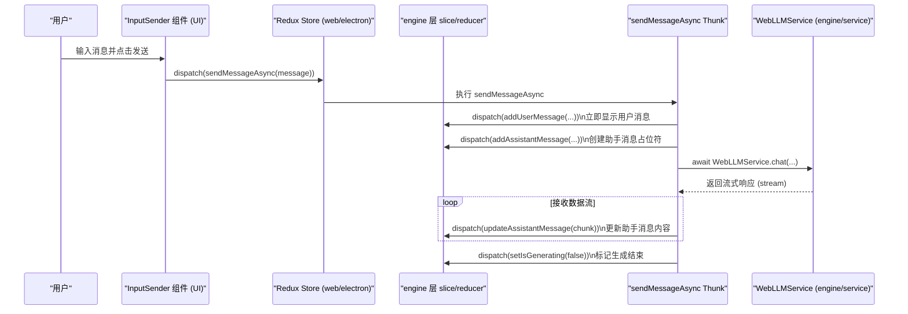

| 时间类型     | 时间                | 情况摘要                                                                                               | 我的要求摘要                     |
| ------------ | ------------------- | ------------------------------------------------------------------------------------------------------ | -------------------------------- |
| 创建时间     | 2024-07-16T08:00:00Z | 在将 Web 应用状态管理重构为 Redux Toolkit 后，用户希望了解在新架构下，一次完整的聊天交互的调用流程。 | "介绍触发本地化的调用路径" |
| 最后更新时间 | 2024-07-16T08:00:00Z | 2024-07-16 多端复用架构重构，强调 engine 层 slice/reducer 复用与 UI/业务解耦。 | 适配 Redux+engine 多端复用架构 |

---

### 正文主体

#### 新版调用流程说明（多端复用架构）

本流程基于 Redux store + engine 层 slice/reducer + WebLLMService 的分层设计，**UI 只 dispatch/select，所有业务逻辑和数据流都在 engine 层和 Redux slice**，支持 web、electron、node 多端复用。

1.  **用户输入**: 用户在 `InputSender` 组件输入消息，点击发送。
2.  **UI 只负责派发异步 Action**: `InputSender` 通过 `dispatch(sendMessageAsync(message))` 启动异步流程。
3.  **Redux slice/engine 层处理业务**:
    *   `sendMessageAsync` thunk 首先派发同步 action（如 `addUserMessage`），slice 立即更新状态，UI 立刻响应。
    *   Thunk 继续调用 engine 层的 WebLLMService（或其它 service），组装请求参数（如 model、apiKey），并发起流式请求。
    *   engine 层 slice/reducer 负责所有业务逻辑和数据流转，web/node/electron 可完全复用。
4.  **流式响应与消息更新**:
    *   Thunk 持续监听 WebLLMService 返回的数据流。
    *   每收到一段内容就派发 `updateAssistantMessage`，slice/reducer 负责拼接内容，UI 自动响应。
5.  **流程结束/错误处理**:
    *   数据流结束后，Thunk 派发 `setIsGenerating(false)` 等 action，slice 更新状态。
    *   发生错误时，Thunk 捕获并派发错误 action，slice 统一处理。

#### 多端复用与扩展说明

- **engine 层 slice/reducer/工具/类型全部无 UI 依赖，web/node/electron/主进程/脚本均可直接 import 复用。**
- **web/electron 渲染进程用 Redux hooks 连接 UI，主进程/node 直接用 Redux 原生 API 操作 store。**
- **WebLLMService/engine 层 service 负责所有与 LLM/后端的交互，参数组装、默认值兜底、错误处理全部在 engine 层完成。**
- **如需跨进程/多端同步（如 electron 主进程 <-> 渲染进程），可通过 IPC 只同步必要的全局配置。**

#### 可视化调用图（新版多端分层）

---

#### 关键点总结
- UI 组件只 dispatch/select，不直接操作业务逻辑。
- 所有业务逻辑、数据流、参数组装、默认值兜底全部在 engine 层 slice/reducer/service 完成。
- 多端（web/node/electron/主进程）可直接 import engine 层 slice/reducer/工具，保证一致性和可维护性。
- 跨进程同步只同步必要配置，业务数据各自维护。 