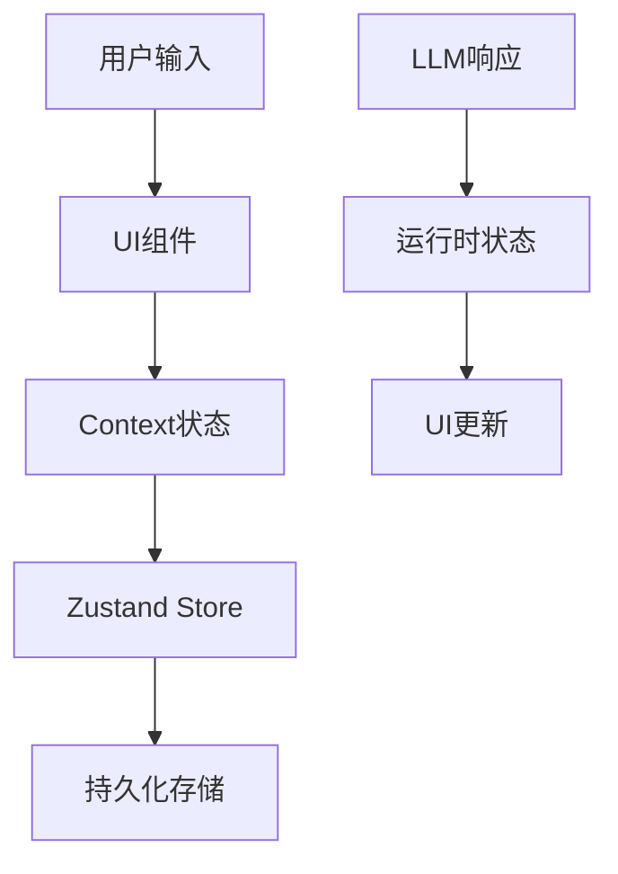

# AI Chat 应用架构设计文档

## 1. 数据流设计

### 1.1 状态管理层次

```
全局状态 (Zustand Store)
  ↓
Context (UI状态)
  ↓
组件状态 (Local State)
```

#### 1.1.1 Zustand Store 职责
- `/store/chatStore.ts`: 聊天数据的持久化存储
- `/store/llmConfigStore.ts`: LLM配置管理
- `/store/modelConfigStore.ts`: 模型配置管理
- `/store/pluginStore.ts`: 插件状态管理
- `/store/themeStore.ts`: 主题配置
- `/store/chatRuntimeStore.ts`: 聊天运行时状态管理

#### 1.1.2 Context 职责
- `/contexts/chat/`: 聊天界面UI状态管理
- `/contexts/modal/`: 模态框状态管理
- `/contexts/list/`: 列表选择状态管理

### 1.2 数据流向



## 2. 技术栈实现

### 2.1 前端技术栈

- **构建工具**: Vite
  - 开发时 HMR
  - 生产环境优化
  - 插件系统支持

- **状态管理**: Zustand
  ```typescript
  // 示例: chatStore.ts
  export const useChatStore = create<ChatState>()(
    persist(
      (set) => ({
        messages: [],
        addMessage: (message) => 
          set((state) => ({
            messages: [...state.messages, message]
          })),
      }),
      {
        name: 'chat-storage',
      }
    )
  );
  ```

- **样式方案**: Less + CSS Modules
  ```less
  // 示例: styles.less
  .chat-container {
    @import '../../styles/variables';
    
    display: flex;
    flex-direction: column;
    
    .message-list {
      flex: 1;
      overflow-y: auto;
    }
  }
  ```

### 2.2 后端服务

#### 2.2.1 Python 后端 (MCP)
- FastAPI 框架
- 异步请求处理
- WebSocket 支持
- 插件系统集成

#### 2.2.2 Node.js 后端
- Express 框架
- 静态资源服务
- API 代理
- 开发服务器

### 2.3 桌面应用

使用 Electron 构建桌面应用:

```typescript
// main/index.ts
app.on('ready', () => {
  const win = new BrowserWindow({
    width: 1200,
    height: 800,
    webPreferences: {
      nodeIntegration: true,
      contextIsolation: true,
    },
  });
  
  // 加载前端应用
  win.loadURL(process.env.VITE_DEV_SERVER_URL);
});
```

## 3. 插件系统

### 3.1 插件类型

1. **渲染插件**
   - Markdown 渲染
   - 代码高亮
   - LaTeX 公式
   - 图表绘制

2. **工具插件**
   - 文件处理
   - 代码执行
   - API调用
   - 数据分析

3. **主题插件**
   - 颜色方案
   - 组件样式
   - 动画效果

### 3.2 插件接口

```typescript
interface Plugin {
  id: string;
  name: string;
  version: string;
  type: 'renderer' | 'tool' | 'theme';
  register: (api: PluginAPI) => void;
  unregister?: () => void;
}

interface PluginAPI {
  registerRenderer: (renderer: Renderer) => void;
  registerTool: (tool: Tool) => void;
  registerTheme: (theme: Theme) => void;
}
```

## 4. 多端适配

### 4.1 Web 端


### 4.2 桌面端
- 本地mcp服务集成
- 离线功能

### 4.3 小程序端
- 轻量化UI
- 微信API集成


## 5. 性能优化

### 5.1 前端优化
- 代码分割
- 懒加载
- 虚拟列表
- 缓存策略

### 5.2 构建优化
- Tree-shaking
- 压缩混淆
- 资源优化
- CDN部署

## 6. 安全性

### 6.1 前端安全
- XSS防护
- CSRF防护
- 敏感信息加密

### 6.2 API安全
- 认证授权
- 请求限流
- 数据校验

## 7. 监控和日志

### 7.1 性能监控
- 页面加载时间
- API响应时间
- 资源使用情况

### 7.2 错误监控
- JS错误捕获
- API错误统计
- 性能异常报警

### 7.3 用户行为分析
- 页面访问
- 功能使用
- 异常操作
