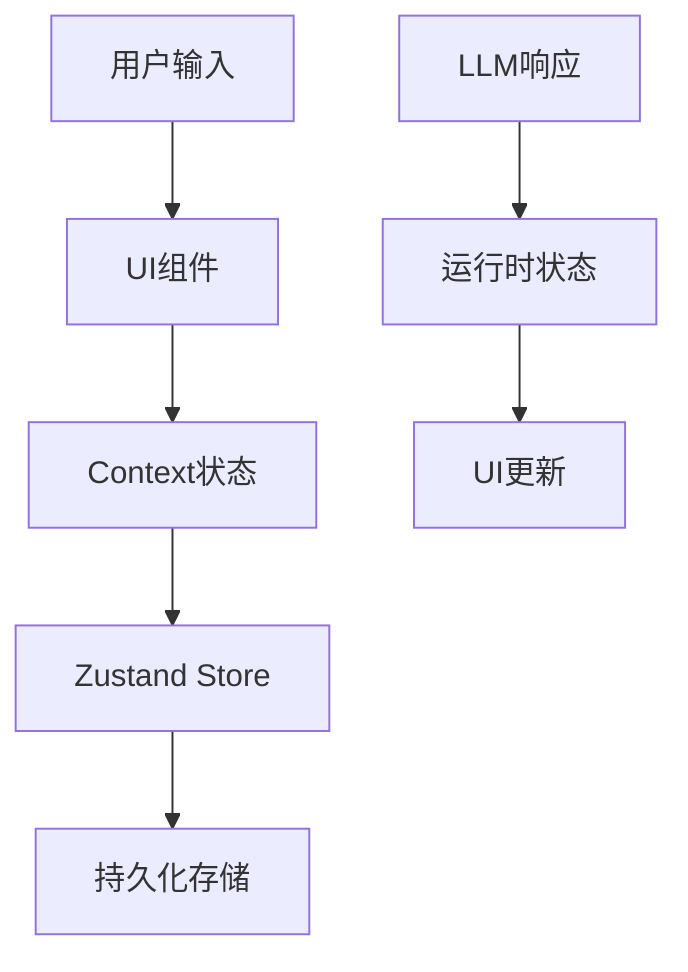

# AI Chat 应用架构设计文档

## 1. 数据流设计

### 1.1 状态管理层次

```
全局状态 (Zustand Store)
  ↓
Context (UI状态)
  ↓
组件状态 (Local State)
```

#### 1.1.1 全局状态 (已实现)
- `/store/chatStore.ts`: 聊天数据的持久化存储
- `/store/llmConfigStore.ts`: LLM配置管理
- `/store/modelConfigStore.ts`: 模型配置管理
- `/store/themeStore.ts`: 主题配置
- `/store/chatRuntimeStore.ts`: 聊天运行时状态管理

相关技术:
- [Zustand基础用法](./zustand-guide.md) (TODO)
  - create store
  - middleware (persist, devtools)
  - typescript支持
  - store组合

#### 1.1.2 Context 职责
- `/contexts/chat/`: 聊天界面UI状态管理
- `/contexts/modal/`: 模态框状态管理
- `/contexts/list/`: 列表选择状态管理

### 1.2 数据流向



## 2. 技术栈实现

### 2.1 前端技术栈

- **构建工具**: Vite
  - 开发时 HMR
  - 生产环境优化
  - 插件系统支持

- **状态管理**: Zustand
  ```typescript
  // 示例: chatStore.ts
  export const useChatStore = create<ChatState>()(
    persist(
      (set) => ({
        messages: [],
        addMessage: (message) => 
          set((state) => ({
            messages: [...state.messages, message]
          })),
      }),
      {
        name: 'chat-storage',
      }
    )
  );
  ```

- **样式方案**: Less + CSS Modules
  ```less
  // 示例: styles.less
  .chat-container {
    @import '../../styles/variables';
    display: flex;
    flex-direction: column;
    .message-list {
      flex: 1;
      overflow-y: auto;
    }
  }
  ```

### 2.2 LLM 集成

#### 2.2.1 OpenAI/Deepseek/多模型集成（已实现）
- [OpenAI SDK指南](./openai-guide.md) (TODO)
  - Stream API
  - Tool Calls
  - Function Calling
  - 错误处理
- Deepseek API 流式响应与多字段支持（reasoning_content, tool_content, observation_content, thought_content）
- 统一的流式处理与 runtime store 更新逻辑
- 详见 [chat-flow.md](./chat-flow.md)
- Deepseek/OpenAI 响应的 chunk.id 仅用于云端追踪，本地消息 id 统一采用 uuid v4，避免混淆，详见 chat-flow.md。
- Markdown 渲染采用 dangerouslySetInnerHTML，防止 HTML 以字符串显示，详见 renderer.md。
- runtime store 负责流式和临时状态，持久化存储仅保存稳定消息，二者通过 useChatMessages 等 hook 保持同步。

#### 2.2.2 其他模型适配 (待实现)
- Claude API
- Anthropic SDK
- 本地模型

### 2.3 桌面应用

使用 Electron 构建桌面应用:

```typescript
// main/index.ts
app.on('ready', () => {
  const win = new BrowserWindow({
    width: 1200,
    height: 800,
    webPreferences: {
      nodeIntegration: true,
      contextIsolation: true,
    },
  });
  // 加载前端应用
  win.loadURL(process.env.VITE_DEV_SERVER_URL);
});
```

## 3. 插件系统

### 3.1 插件类型

1. **渲染插件**
   - Markdown 渲染（支持 dangerouslySetInnerHTML，详见 renderer.md）
   - 代码高亮
   - LaTeX 公式
   - 图表绘制

2. **工具插件**
   - 文件处理
   - 代码执行
   - API调用
   - 数据分析

3. **主题插件**
   - 颜色方案
   - 组件样式
   - 动画效果

### 3.2 插件接口

```typescript
interface Plugin {
  id: string;
  name: string;
  version: string;
  type: 'renderer' | 'tool' | 'theme';
  register: (api: PluginAPI) => void;
  unregister?: () => void;
}

interface PluginAPI {
  registerRenderer: (renderer: Renderer) => void;
  registerTool: (tool: Tool) => void;
  registerTheme: (theme: Theme) => void;
}
```

## 4. 多端适配

### 4.1 Web 端 (已实现)
- 基于 React + Vite
- Electron 环境集成
- Ant Design 组件库
- 响应式布局

### 4.2 桌面端 (待实现)
需要了解:
- [Electron 开发指南](./electron-guide.md) (TODO)
  - 主进程通信
  - 本地服务集成
  - 离线功能

### 4.3 小程序端 (待实现)
需要了解:
- [小程序开发指南](./miniprogram-guide.md) (TODO)
  - 框架限制
  - 网络请求
  - 组件适配

## 5. 开发计划

### 5.1 近期目标
1. 完善基础聊天功能
   - Stream处理优化
   - 错误处理完善
   - 消息状态管理（多状态流转、UI同步、runtime store 与持久化分离）
   - Deepseek/多模型流式字段支持
2. 文档补充
   - 补充各项技术指南
   - 完善API文档
   - 添加开发示例
   - [Markdown渲染机制说明](./renderer.md)

### 5.2 中期规划
1. 插件系统实现
2. 更多模型支持
3. 桌面端适配

### 5.3 远期规划
1. 小程序端开发
2. 性能优化
3. 更多功能扩展
