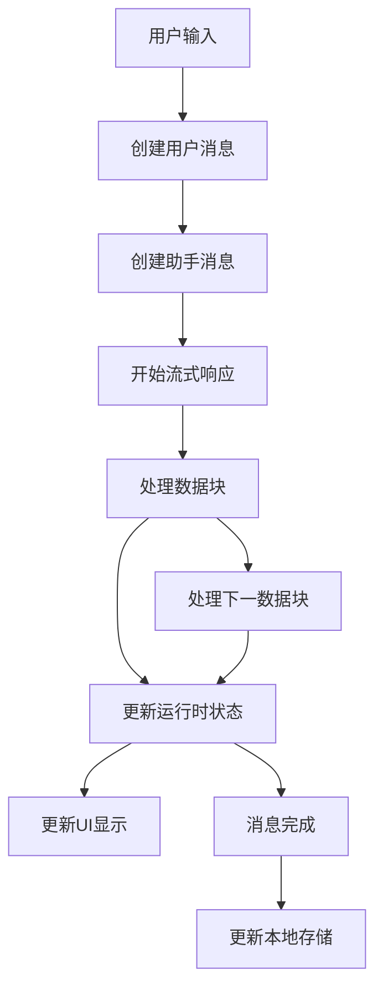

# 聊天流程与数据存储文档

## 1. 页面初始化阶段

### 1.1 页面加载
- `Chat/index.tsx` 组件加载时，通过 `useParams` 获取 URL 中的 `chatId`
- 初始化 `useChatMessages` hook，传入 `chatId`（已支持 null 处理，内部统一用 safeChatId）
- 通过 `useChatStore` 获取消息操作方法

### 1.2 消息数据初始化
```typescript
// 在 useChatMessages hook 中
useEffect(() => {
  let mounted = true;
  const loadChatMessages = async () => {
    if (safeChatId) {
      const chatData = chatStorage.getChatData(safeChatId);
      if (mounted && chatData?.messages) {
        // 加载聊天数据并设置所有消息为稳定状态
        const runtimeMessages = chatData.messages.map(msg => ({
          ...msg,
          status: 'stable'
        }));
        setLocalMessages(runtimeMessages);
      }
    }
  };
  loadChatMessages();
}, [safeChatId]);
```

## 2. 用户输入阶段

### 2.1 用户输入处理
- 用户在输入框中输入内容
- `handleSend` 函数被触发
- 创建用户消息：
```typescript
const userMessage = createMessage.user(inputValue.trim());
addMessage(userMessage);
```

### 2.2 创建助手消息
- 创建初始的助手消息（空内容）：
```typescript
const assistantMessage = createMessage.assistant('');
addMessage(assistantMessage);
```

## 3. 流式响应阶段

### 3.1 初始化流处理
- 调用 LLM 服务获取响应流（支持 OpenAI/Deepseek 等多模型，流式字段兼容）
- 创建新的 AbortController 用于可能的中断
- 开始处理流式响应

### 3.2 处理每个数据块
```typescript
// streamHandler.ts
for await (const chunk of stream) {
  const delta = chunk.choices[0]?.delta;
  // Deepseek 多字段处理
  if (delta.reasoning_content && delta.reasoning_content !== 'null') {
    reasoning_content += delta.reasoning_content;
  }
  if (delta.tool_content && delta.tool_content !== 'null') {
    tool_content += delta.tool_content;
  }
  if (delta.observation_content && delta.observation_content !== 'null') {
    observation_content += delta.observation_content;
  }
  if (delta.thought_content && delta.thought_content !== 'null') {
    thought_content += delta.thought_content;
  }
  if (delta.content && delta.content !== 'null') {
    content += delta.content;
  }
  // 通过回调更新消息
  onChunk?.({
    content,
    reasoning_content,
    tool_content,
    observation_content,
    thought_content,
    status: 'generating'
  });
}
```

### 3.3 实时更新 UI
- 每个数据块到达时更新运行时状态：
```typescript
updateLastMessage({
  content: chunk.content,
  reasoning_content: chunk.reasoning_content,
  tool_content: chunk.tool_content,
  observation_content: chunk.observation_content,
  thought_content: chunk.thought_content,
  status: 'generating'
});
// 同时更新运行时存储
updateMessageContent({
  messageId: lastMessage.id,
  content: chunk.content,
  reasoning_content: chunk.reasoning_content,
  tool_content: chunk.tool_content,
  observation_content: chunk.observation_content,
  thought_content: chunk.thought_content,
});
```

## 4. 完成与存储阶段

### 4.1 流处理完成
- 清理连续的 "null" 值
- 更新最终内容和状态：
```typescript
updateLastMessage({
  content: result.content,
  reasoning_content: result.reasoning_content,
  tool_content: result.tool_content,
  observation_content: result.observation_content,
  thought_content: result.thought_content,
  status: 'stable'
});
```

### 4.2 本地存储更新
```typescript
// 在 useChatMessages 的 updateLastMessage 中
if (update.status === 'stable') {
  const chatData = chatStorage.getChatData(safeChatId);
  // 将 RuntimeMessage 转换为 ChatMessage
  const chatMessages = newMessages.map(msg => {
    const { status, ...chatMessage } = msg;
    return chatMessage;
  });
  // 保存到本地存储
  chatStorage.saveChatData(safeChatId, {
    info: chatData?.info || {
      id: safeChatId,
      title: '新对话',
      createTime: Date.now(),
      updateTime: Date.now(),
      messageCount: chatMessages.length
    },
    messages: chatMessages,
    settings: chatData?.settings,
    updateTime: Date.now()
  });
}
```

## 数据流转示意图



## 存储层级

1. **临时运行时状态**
   - 位置：`chatRuntimeStore.ts`
   - 用途：处理消息生成过程中的临时状态
   - 特点：包含 status、reasoning_content、tool_content、observation_content、thought_content 等运行时信息

2. **页面状态**
   - 位置：`useChatMessages` hook
   - 用途：维护当前页面显示的消息列表
   - 特点：包含完整的消息内容和状态

3. **持久化存储**
   - 位置：`chatStorage.ts`
   - 用途：持久化存储聊天记录
   - 特点：只存储稳定状态的消息，不包含临时状态信息

## 关键注意点

1. 消息状态转换
   - connecting -> thinking -> generating -> stable
   - 每个状态都有对应的 UI 显示（详见 MessageCard 组件 renderStatus）

2. 数据清理
   - 在多个层级都有对 "null" 值的处理
   - 流处理时过滤
   - 显示时清理
   - 存储时确保数据完整性

3. 状态同步
   - 运行时状态和持久化状态的同步
   - 确保用户可见的状态和存储的状态一致

4. Markdown 渲染
   - 所有 markdownToHtml 渲染均使用 dangerouslySetInnerHTML，防止 HTML 以字符串显示，详见 [renderer.md](./renderer.md)
