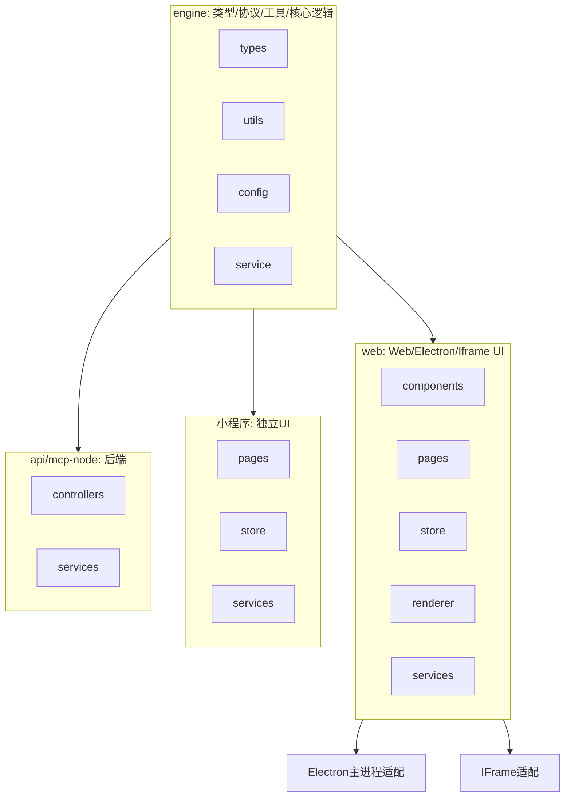

# ZZ AI Chat 多端架构设计

## 1. 架构分层与目录结构

```
zz-ai-chat/
├── engine/           # 跨端共享的核心类型、协议、工具、业务逻辑（无 UI 依赖）
│   ├── types/        # 通用类型定义（chat, plugin, llm, model, ...）
│   ├── utils/        # 通用工具函数（storage, xml, ...）
│   ├── config/       # 通用配置结构
│   └── service/      # 与 UI 无关的核心服务逻辑（如有）
├── web/              # Web/Electron/Iframe 端 UI 及适配
│   ├── src/
│   │   ├── components/   # 仅 Web/Electron/Iframe 端 UI 组件
│   │   ├── pages/        # 页面
│   │   ├── store/        # 状态管理
│   │   ├── hooks/        # React hooks
│   │   ├── renderer/     # Markdown/插件等渲染器
│   │   ├── services/     # LLM/后端 API 调用，适配 engine/service
│   │   ├── types/        # 仅前端用的类型
│   │   └── ...
├── miniprogram/      # 微信小程序端，独立 UI，复用 engine 逻辑
├── electron/         # Electron 主进程，仅适配
├── iframe/           # Iframe 适配层
├── api/              # Node.js/TS 后端，复用 engine 逻辑
├── mcp-node/         # Node 侧模型服务，复用 engine 逻辑
├── mcp-python/       # Python 侧模型服务
└── docs/             # 文档
```

## 2. 各端复用与适配说明

- **engine/**：
  - 只放类型、协议、工具、核心业务逻辑（无 UI/框架依赖）。
  - 供 web、api、electron、iframe、miniprogram、mcp-node 等多端直接 import。
- **web/**：
  - 负责 Web/Electron/Iframe 端 UI 及适配。
  - 通过 tsconfig 路径别名 @engine/* 直接复用 engine 代码。
- **miniprogram/**：
  - 微信小程序端，UI 独立实现，业务逻辑/类型/协议可直接 import engine/。
- **electron/**、**iframe/**：
  - 仅做主进程/适配层，UI 由 web 端统一管理。
- **api/**、**mcp-node/**：
  - 作为后端服务，直接 import engine/ 共享类型、协议、工具。

## 3. 架构图



## 4. 迁移建议

### 推荐迁移到 engine 的内容：
- 所有 src/types/ 下的通用类型（chat, plugin, llm, model, ...）
- src/utils/ 下的无 UI 依赖工具（storage, xml, messageFactory, ...）
- src/config/ 下的通用配置结构
- 与 UI 无关的核心协议/业务逻辑
- **所有纯逻辑 store、service、React/Vue hooks（如 useLLMConfig、useChatMessages、useModelConfig 等），只要不直接依赖 UI 组件/渲染/事件，均应迁移到 engine 下的 hooks/、store/、service/ 等目录。**

### 不应迁移到 engine 的内容：
- 任何 React/Vue 组件、UI hooks（如 useModal/useTheme/useSider 等）、页面、样式
- 任何依赖 UI 框架的渲染器
- 只服务于 web 的业务逻辑
- 任何 UI/端到端/集成测试（仅迁移 engine 相关的纯逻辑单元测试）

---

如需自动迁移具体文件或生成 tsconfig 路径别名，请告知！
