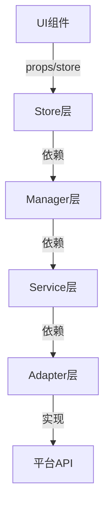

非常好的思路！下面我将分阶段、分文档，系统性地为你梳理新架构，兼顾多端复用（Web/Electron），并以“统一消息类型+分层Store+适配器模式”为核心，逐步输出文档到 `docs/新架构/` 目录。每个文档会从概括到细分，包含代码示例，便于团队理解和落地。

---

## 第一阶段：总体架构概览

**文档1：`docs/新架构/总体架构概览.md`**

### 1.1 架构目标
- **多端复用**：核心逻辑最大化放在 `src/`，Web/Electron/Node 仅做适配。
- **统一消息类型**：所有消息类型集中定义，避免跨层/跨端类型转换。
- **分层Store**：状态管理分层，职责单一，便于维护和扩展。
- **适配器模式**：所有平台相关实现通过 Adapter 注入，核心逻辑不感知平台差异。
- **Manager/Store/Hook/Service分工明确**：Manager 只做业务，Store 只做状态，Hook 只做副作用，Service 只做IO/协议。

### 1.2 层次结构


---

## 第二阶段：统一消息类型设计

**文档2：`docs/新架构/统一消息类型设计.md`**

### 2.1 统一消息类型定义
```typescript
// src/types/message.ts
export interface BaseMessage {
  id: string;
  role: 'user' | 'assistant' | 'system' | 'tool' | 'client-notice';
  content: string;
  timestamp: number;
  status?: MessageStatus;
  name?: string;
  [key: string]: any; // 扩展字段
}

export interface RuntimeMessage extends BaseMessage {
  status: MessageStatus;
  reasoning_content?: string;
  tool_content?: string;
  observation_content?: string;
  thought_content?: string;
}

export type MessageStatus = 'connecting' | 'thinking' | 'generating' | 'stable' | 'done' | 'error';
```
- **说明**：所有消息类型都从 `BaseMessage` 派生，Web/Electron/服务端均复用。

---

## 第三阶段：分层Store与状态管理

**文档3：`docs/新架构/分层Store与状态管理.md`**

### 3.1 Store分层建议
- **ChatStore**：负责持久化聊天列表、当前会话ID、全局设置。
- **RuntimeStore**：负责运行时消息状态（如流式生成、临时内容、abortController）。
- **UIStore**：负责UI相关状态（如loading、modal、主题等）。

### 3.2 Store示例
```typescript
// src/store/chatStore.ts
export interface ChatStoreState {
  chats: ChatInfo[];
  currentChatId: string | null;
  settings: ChatSettings;
  // ...操作方法
}

// src/store/runtimeStore.ts
export interface RuntimeStoreState {
  runtimeMessages: Record<string, RuntimeMessage>;
  isGenerating: boolean;
  abortController: AbortController | null;
  // ...操作方法
}

// src/store/uiStore.ts
export interface UIStoreState {
  loadingCount: number;
  modalStates: Record<string, boolean>;
  theme: 'light' | 'dark';
  // ...操作方法
}
```
- **说明**：Store只存储状态，不做业务逻辑，所有消息都用统一类型。

---

## 第四阶段：Manager与Service适配器

**文档4：`docs/新架构/Manager与Service适配器.md`**

### 4.1 Manager职责
- **MessageManager**：只做消息的CRUD和状态管理。
- **ChatManager**：只做会话的增删改查和切换。
- **SessionManager**：只做流式处理、消息流转、状态订阅。

### 4.2 Service与Adapter
- **Service**：只定义接口和抽象逻辑。
- **Adapter**：Web/Electron/Node各自实现，注入到Service。

```typescript
// src/service/base/LLMService.ts
export abstract class BaseLLMService {
  abstract createChatStream(messages: RuntimeMessage[], config: LLMConfig): Promise<ReadableStream<Uint8Array>>;
  abstract abortCurrentStream(): void;
}

// src/service/web/WebLLMService.ts
export class WebLLMService extends BaseLLMService { /* ... */ }

// src/service/electron/ElectronLLMService.ts
export class ElectronLLMService extends BaseLLMService { /* ... */ }
```

---

## 第五阶段：典型调用链与多端适配

**文档5：`docs/新架构/调用链与多端适配.md`**

### 5.1 典型调用链
```
UI组件 → useWebChat → useChatSession → SessionManager → LLMService → 流式处理 → MessageManager → Store更新 → UI刷新
```

### 5.2 多端适配
- **Web**：通过WebLLMService、LocalStorageAdapter、WebStreamAdapter等适配
- **Electron**：通过ElectronLLMService、FileStorageAdapter、ElectronStreamAdapter等适配
- **Node/Server**：可扩展ServerLLMService等

---

## 第六阶段：迁移与落地建议

**文档6：`docs/新架构/迁移与落地建议.md`**

### 6.1 迁移步骤
1. 统一消息类型，删除冗余类型
2. 拆分/重构Store，按分层职责迁移
3. Manager/Service/Adapter分离，核心逻辑迁移到src
4. Web/Electron分别实现Adapter
5. 全局类型、接口、调用链文档同步更新

---

### 下一步
请确认上述分阶段方案和文档结构是否符合你的预期，我会逐步输出每个文档内容。  
如需先看某一部分细节（如Store设计、Manager代码等），请指定优先级！