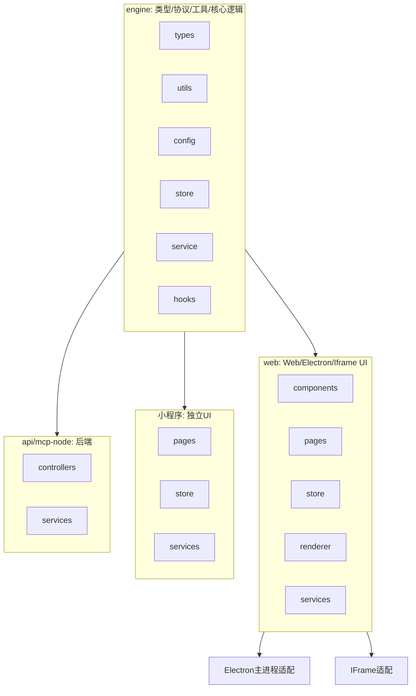

# ZZ AI Chat 多端架构设计

## 1. 架构分层与目录结构

```
zz-ai-chat/
├── engine/           # 跨端共享的核心类型、协议、工具、业务逻辑（无 UI 依赖，已最大化迁移并通过测试）
│   ├── types/        # 通用类型定义（chat, plugin, llm, model, ...）
│   ├── utils/        # 通用工具函数（storage, xml, ...）
│   ├── config/       # 通用配置结构
│   ├── store/        # 纯逻辑 store（无 UI 依赖）
│   ├── service/      # 与 UI 无关的核心服务逻辑
│   └── hooks/        # 纯逻辑 hooks（无 UI 依赖）
├── web/              # Web/Electron/Iframe 端 UI 及适配（仅保留 UI、UI hooks、页面、渲染器等）
│   ├── src/
│   │   ├── components/   # 仅 Web/Electron/Iframe 端 UI 组件
│   │   ├── pages/        # 页面
│   │   ├── store/        # 仅 UI 状态/适配
│   │   ├── hooks/        # 仅 UI hooks
│   │   ├── renderer/     # Markdown/插件等渲染器
│   │   ├── services/     # 仅 UI 适配/调用，核心逻辑复用 engine/service
│   │   ├── types/        # 仅前端用的类型
│   │   └── ...
├── miniprogram/      # 微信小程序端，独立 UI，复用 engine 逻辑
├── electron/         # Electron 主进程，仅适配
├── iframe/           # Iframe 适配层
├── api/              # Node.js/TS 后端，复用 engine 逻辑
├── mcp-node/         # Node 侧模型服务，复用 engine 逻辑
├── mcp-python/       # Python 侧模型服务
└── docs/             # 文档
```

## 2. 各端复用与适配说明

- **engine/**：
  - 已迁移所有可复用类型、协议、工具、核心业务逻辑、store、service、hooks（无 UI/框架依赖），并通过测试。
  - 供 web、api、electron、iframe、miniprogram、mcp-node 等多端直接 import。
- **web/**：
  - 只保留 UI 组件、UI hooks、页面、渲染器等，所有可复用逻辑均通过 @engine/* 路径别名直接 import。
  - 构建、运行、测试均依赖 engine，engine 变更需先通过 engine 测试再集成到 web。
  - 如需新功能，优先在 engine 实现纯逻辑部分，仅 UI 相关留在 web。
- **miniprogram/**：
  - 微信小程序端，UI 独立实现，业务逻辑/类型/协议可直接 import engine/。
- **electron/**、**iframe/**：
  - 仅做主进程/适配层，UI 由 web 端统一管理。
- **api/**、**mcp-node/**：
  - 作为后端服务，直接 import engine/ 共享类型、协议、工具。

## 3. 架构图



## 4. 迁移与开发建议

### 推荐迁移到 engine 的内容：
- 所有 src/types/ 下的通用类型（chat, plugin, llm, model, ...）
- src/utils/ 下的无 UI 依赖工具（storage, xml, messageFactory, ...）
- src/config/ 下的通用配置结构
- 与 UI 无关的核心协议/业务逻辑
- 所有纯逻辑 store、service、hooks（如 useLLMConfig、useChatMessages、useModelConfig 等），只要不直接依赖 UI 组件/渲染/事件，均应迁移到 engine 下对应目录。

### 不应迁移到 engine 的内容：
- 任何 React/Vue 组件、UI hooks（如 useModal/useTheme/useSider 等）、页面、样式
- 任何依赖 UI 框架的渲染器
- 只服务于 web 的业务逻辑
- 任何 UI/端到端/集成测试（仅迁移 engine 相关的纯逻辑单元测试）

### 构建与测试建议
- web 构建前需确保 engine 已构建通过（tsc -b engine）。
- engine 变更需先通过 engine 测试（test:engine），再集成到 web。
- web 端如需补充集成测试，建议聚焦 UI 与 engine 逻辑结合部分。

---

如需自动迁移具体文件、生成 tsconfig 路径别名或 web 层测试样例，请告知！
