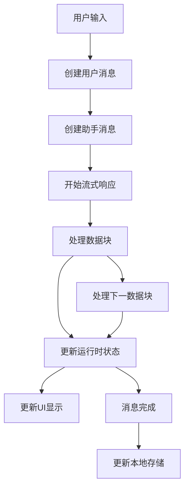

# 数据流（Data Flow）

- 本文档原名“聊天流程”，现统一为“数据流”，描述消息、状态、API 调用等在系统中的流转过程。

## 开发计划任务列表

1. **持续优化多端同构与类型复用**
   - 检查 engine 目录下类型、store、service、hooks 的复用情况，确保 web 端与其它端最大化共享逻辑。
   - 新增/变更业务逻辑时，优先在 engine 层实现并导出。

2. **全局 useStore 响应式用法一致性排查与修正**
   - 检查 web 端所有页面、hooks、组件，确保均通过 useStore(useXXXStore, selector) 获取/操作状态。
   - 避免直接调用 store 实例。
   - 如有遗漏，补充修正并补充测试。

3. **业务 store 统一 engine/storeDefinition + zustand-pub 绑定**
   - 定期检查 chatStore、roleStore、mcpStore、chatRuntimeStore 的绑定方式，防止回退为旧写法。
   - 新增业务 store 时，按最佳实践实现。

4. **UI/端专属 store 规范与多端复用评估**
   - pluginStore、themeStore 等如需多端复用，迁移到 engine/store。
   - 仅 UI/端专属状态可用 create+persist。

5. **MCP 系统后端联动与多端同步（预研/待定）**
   - MCP store、页面与后端/多端联动方案设计与实现。
   - 关注 engine/store/mcpStore.ts 及相关服务层。

6. **自动化测试与类型/运行时错误修复**
   - 持续完善自动化测试，确保 web 端主流程无类型和运行时错误。
   - 新增/变更功能时补充测试用例。

7. **文档同步与最佳实践沉淀**
   - 持续补充/更新 chat-flow.md、multi-platform-architecture.md、engine-migration-guide.md 等文档。
   - 明确多端同构、数据流、MCP 系统现状与最佳实践。
   - **本地存储最佳实践：所有持久化操作仅在消息状态为 stable 时进行，避免性能浪费和数据不一致。**

8. **新需求/优化项跟踪**
   - 跟踪 pluginStore/themeStore 多端复用、MCP 后端联动等新需求。
   - 及时补充迁移和优化。

---

## 0. 多端同构 store 绑定最佳实践

- 所有核心业务 store（chatStore、roleStore、mcpStore、chatRuntimeStore）均采用 engine/storeDefinition 方案：
  - 纯逻辑 storeDefinition 统一放在 engine/store 下，供 web、api、electron、miniprogram 等多端直接 import。
  - web 端通过 zustand create 绑定 engine 层 storeDefinition，导出 useXXXStore，保证多端同构、类型安全、最大复用。
  - 页面、hooks、组件全部通过 useStore(useXXXStore, selector) 响应式获取和操作状态，避免直接调用 store 实例。
- UI/端专属 store（如 themeStore、pluginStore）可用 create + persist，若需多端复用可迁移到 engine/store。
- 所有数据流、状态管理、持久化均以 store 为中心，storage 仅在 stable 状态时写入，避免性能浪费。

## 0.1 MCP 系统说明

- 当前 MCP（多模型控制/插件）系统尚未实装，仅有部分前端交互和 store 结构，后端与实际模型服务尚未接入。
- 相关页面和 store 仅供 UI 体验和前端交互测试，后续如需联动后端或多端同步，可在 engine/store/mcpStore.ts 及相关服务层补充实现。

---

## 1. 页面初始化阶段

### 1.1 页面加载
- `Chat/index.tsx` 组件加载时，通过 `useParams` 获取 URL 中的 `chatId`
- 初始化 `useChatMessages` hook，传入 `chatId`（已支持 null 处理，内部统一用 safeChatId）
- 通过 `useChatStore` 获取消息操作方法

### 1.2 消息数据初始化
```typescript
// 在 useChatMessages hook 中
useEffect(() => {
  let mounted = true;
  const loadChatMessages = async () => {
    if (safeChatId) {
      const chatData = chatStorage.getChatData(safeChatId);
      if (mounted && chatData?.messages) {
        // 加载聊天数据并设置所有消息为稳定状态
        const runtimeMessages = chatData.messages.map(msg => ({
          ...msg,
          status: 'stable'
        }));
        setLocalMessages(runtimeMessages);
      }
    }
  };
  loadChatMessages();
}, [safeChatId]);
```

### 1.3 聊天数据同步到 store（2025.06 优化）
- 页面挂载时，若 URL 中存在 chatId，优先调用 zustand 的 `initFromStorage(chatId)`，主动将本地 chatData 加载到 store（chats/messages/currentId）。
- 这样可确保刷新页面后，聊天内容与本地持久化数据一致，避免因 zustand 初始值为空导致的“页面无消息”问题。
- 该同步流程在 `Chat/index.tsx` 的 useEffect 中实现，优先于其它消息 hook。
- 只有在 chatId 变化时才会重新同步，保证性能和一致性。

### 1.4 useChatMessages hook 初始化
- useChatMessages 依赖于 store 的 currentId 和 messages，确保在 initFromStorage 之后再挂载。
- 只有在消息状态为 stable 时，才会将消息写入本地存储。

## 2. 用户输入阶段

### 2.1 用户输入处理
- 用户在输入框中输入内容
- `handleSend` 函数被触发
- 创建用户消息：
```typescript
const userMessage = createMessage.user(inputValue.trim());
addMessage(userMessage);
```

### 2.2 创建助手消息
- 创建初始的助手消息（空内容）：
```typescript
const assistantMessage = createMessage.assistant('');
addMessage(assistantMessage);
```

## 3. 流式响应阶段

### 3.1 初始化流处理
- 调用 LLM 服务获取响应流（支持 OpenAI/Deepseek 等多模型，流式字段兼容）
- 创建新的 AbortController 用于可能的中断
- 开始处理流式响应

### 3.2 处理每个数据块
```typescript
// streamHandler.ts
for await (const chunk of stream) {
  const delta = chunk.choices[0]?.delta;
  // Deepseek 多字段处理
  if (delta.reasoning_content && delta.reasoning_content !== 'null') {
    reasoning_content += delta.reasoning_content;
  }
  if (delta.tool_content && delta.tool_content !== 'null') {
    tool_content += delta.tool_content;
  }
  if (delta.observation_content && delta.observation_content !== 'null') {
    observation_content += delta.observation_content;
  }
  if (delta.thought_content && delta.thought_content !== 'null') {
    thought_content += delta.thought_content;
  }
  if (delta.content && delta.content !== 'null') {
    content += delta.content;
  }
  // 通过回调更新消息
  onChunk?.({
    content,
    reasoning_content,
    tool_content,
    observation_content,
    thought_content,
    status: 'generating'
  });
}
```

### 3.3 实时更新 UI
- 每个数据块到达时更新运行时状态：
```typescript
updateLastMessage({
  content: chunk.content,
  reasoning_content: chunk.reasoning_content,
  tool_content: chunk.tool_content,
  observation_content: chunk.observation_content,
  thought_content: chunk.thought_content,
  status: 'generating'
});
// 同时更新运行时存储
updateMessageContent({
  messageId: lastMessage.id,
  content: chunk.content,
  reasoning_content: chunk.reasoning_content,
  tool_content: chunk.tool_content,
  observation_content: chunk.observation_content,
  thought_content: chunk.thought_content,
});
```

## 4. 完成与存储阶段

### 4.1 流处理完成
- 清理连续的 "null" 值
- 更新最终内容和状态：
```typescript
updateLastMessage({
  content: result.content,
  reasoning_content: result.reasoning_content,
  tool_content: result.tool_content,
  observation_content: result.observation_content,
  thought_content: result.thought_content,
  status: 'stable'
});
```

### 4.2 本地存储更新
```typescript
// 在 useChatMessages 的 updateLastMessage 中
if (update.status === 'stable') {
  const chatData = chatStorage.getChatData(safeChatId);
  // 将 RuntimeMessage 转换为 ChatMessage
  const chatMessages = newMessages.map(msg => {
    const { status, ...chatMessage } = msg;
    return chatMessage;
  });
  // 保存到本地存储
  chatStorage.saveChatData(safeChatId, {
    info: chatData?.info || {
      id: safeChatId,
      title: '新对话',
      createTime: Date.now(),
      updateTime: Date.now(),
      messageCount: chatMessages.length
    },
    messages: chatMessages,
    settings: chatData?.settings,
    updateTime: Date.now()
  });
}
```

## 数据流转示意图



> ⚠️ 只有在消息状态为 stable 时，才会触发本地存储写入。

## 存储层级

1. **临时运行时状态**
   - 位置：`chatRuntimeStore.ts`
   - 用途：处理消息生成过程中的临时状态
   - 特点：包含 status、reasoning_content、tool_content、observation_content、thought_content 等运行时信息

2. **页面状态**
   - 位置：`useChatMessages` hook
   - 用途：维护当前页面显示的消息列表
   - 特点：包含完整的消息内容和状态

3. **持久化存储**
   - 位置：`chatStorage.ts`
   - 用途：持久化存储聊天记录
   - 特点：**只在消息状态为 stable 时写入本地存储**，不包含临时状态信息，避免频繁写入和性能浪费。

## 关键注意点

1. 消息状态转换
   - connecting -> thinking -> generating -> stable
   - 每个状态都有对应的 UI 显示（详见 MessageCard 组件 renderStatus）

2. 本地存储时机
   - 只有当消息状态为 stable 时，才会触发本地存储写入，避免频繁写入和性能浪费。
   - 运行时状态、页面状态的变更不会立即持久化，只有稳定后才同步到本地存储。

3. 数据清理
   - 在多个层级都有对 "null" 值的处理
   - 流处理时过滤
   - 显示时清理
   - 存储时确保数据完整性

4. 状态同步
   - 运行时状态和持久化状态的同步
   - 确保用户可见的状态和存储的状态一致

5. Markdown 渲染
   - 所有 markdownToHtml 渲染均使用 dangerouslySetInnerHTML，防止 HTML 以字符串显示，详见 [renderer.md](./renderer.md)

---

## 开发计划任务列表

1. **pluginStore/themeStore 多端复用与迁移**
   - 检查 pluginStore、themeStore 是否有多端复用需求
   - 如有必要，迁移到 engine/store，统一 storeDefinition + zustand-pub 绑定
   - 迁移步骤：
     1. 将原有 web/src/store 下的 pluginStore、themeStore 逻辑迁移到 engine/store 下，按 storeDefinition 规范实现纯逻辑部分。
     2. 在 web/src/store 下仅保留 usePluginStore/useThemeStore，使用 zustand-pub 绑定 engine 层 storeDefinition 并导出。
     3. 检查类型定义，确保 engine/store 下类型可被多端直接 import。
     4. 如需持久化，仅在 web 端 useStore 层加 persist，engine 层保持纯净。
     5. 页面/hooks/组件全部通过 useStore(usePluginStore, selector) 或 useStore(useThemeStore, selector) 响应式获取和操作状态，避免直接调用 store 实例。
   - 迁移注意事项：
     - 保证 engine/store 下无端专属依赖，类型和逻辑可被多端直接 import。
     - 避免在 engine 层引入 web 端 UI/持久化相关依赖。
     - 迁移后统一在文档和代码注释中说明调用方式。
   - 多端复用调用示例：
     ```typescript
     // web 端
     import { usePluginStore } from '@/store/pluginStore';
     const plugins = useStore(usePluginStore, s => s.plugins);
     // electron/miniprogram 端
     import { pluginStoreDefinition } from 'engine/store/pluginStore';
     // 结合各端状态管理方案绑定
     ```
   - 保持 web 端 useStore(useXXXStore, selector) 响应式用法

2. **自动化测试完善**
   - 覆盖所有核心 store、hooks、页面的单元测试和集成测试
   - 补充遗漏的测试用例，保证类型安全和数据流正确性

3. **MCP 系统后端联动与多端同步**
   - 设计 MCP store 与后端服务的联动机制
   - 实现多端（web、electron、miniprogram 等）状态同步方案
   - 逐步接入实际模型服务

4. **LLM 选择与错误处理优化**
   - 持续完善 LLM 选择功能，支持更多模型类型
   - 优化非 deepseek LLM 报错卡片的交互体验

5. **文档与最佳实践沉淀**
   - 持续补充和完善 chat-flow.md、engine-migration-guide.md 等文档
   - 总结多端同构 store 绑定、数据流、持久化等最佳实践

6. **新需求跟踪与架构优化**
   - 跟踪 pluginStore/themeStore 多端复用、MCP 后端联动等新需求
   - 及时补充迁移和优化，保持架构一致性和可扩展性
