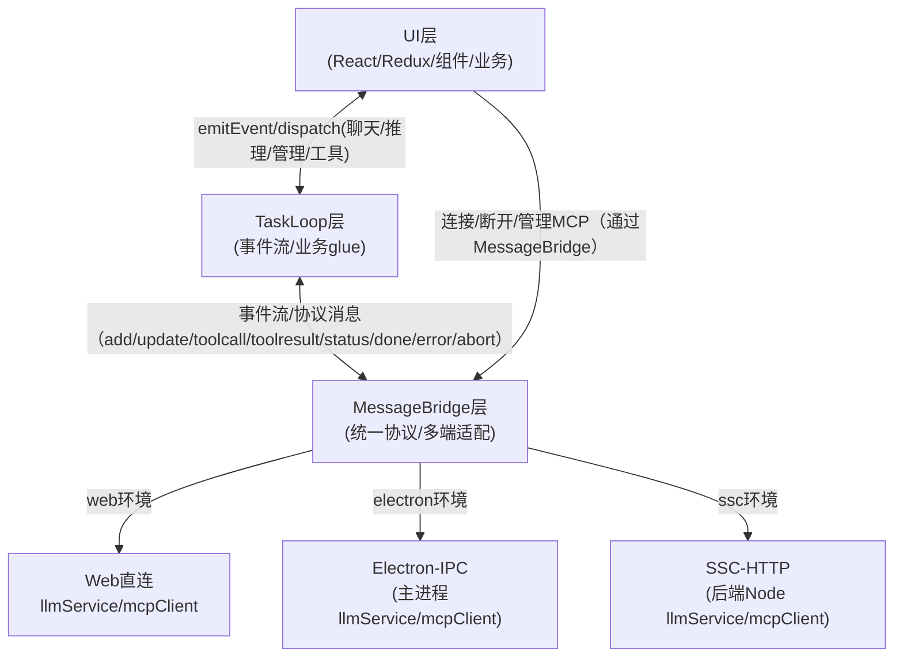

# 多端适配事件流架构图（Mermaid）

> 说明：
> - MessageBridge 层已合并 Adapter/Glue 层，统一负责多端协议分发和环境适配。
> - UI 层与 TaskLoop 双向事件通信，所有业务事件均可订阅和分发。
> - UI 层连接/断开 MCP 也通过 MessageBridge 统一协议分发。
> - TaskLoop 通过 MessageBridge 统一协议分发，与 MCP 管理和多端环境适配。
> - 事件名、payload 结构全端统一，便于维护和扩展。
