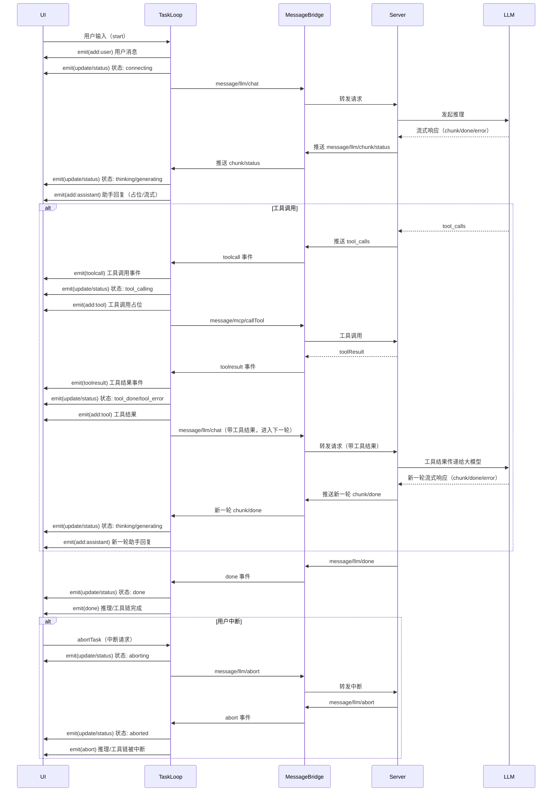

# 事件与消息桥接（event & messagebridge）设计说明

---

## 1. 概念区分

- event（事件）：UI 与 TaskLoop（前端业务层）之间的通信机制，仅用于本地事件流和状态管理，不涉及多端适配。
- messagebridge（消息桥接）：TaskLoop 与服务端（Node/Electron/LLM/MCPServer）之间的协议通信，负责多端适配和跨进程/网络消息传递。

---

## 2. 架构概览

```
[UI] <——(event)——> [TaskLoop] <——(messagebridge)——> [Server/LLM/MCP]
```
- UI 通过订阅 TaskLoop 的事件（如 add/update/toolcall/toolresult/status/done/error/abort）实现消息流和状态流。
- TaskLoop 通过 messagebridge 发送/接收协议消息，实现与服务端的流式推理、工具调用等。

---

## 3. UI 与 TaskLoop 事件机制（event）

- 事件注册：
  ```js
  const unsubscribe = taskLoop.subscribe((event) => {
    // event.type: add, update, toolcall, toolresult, status, done, error, abort
    // 具体处理逻辑见 streamManagerMiddleware.ts
  });
  // 取消订阅
  unsubscribe();
  ```
- 事件类型与说明：
  - add：新增消息（user/assistant/tool）
  - update：流式内容更新（assistant）
  - toolcall：工具调用发起
  - toolresult：工具调用结果
  - status：状态变更（仅用于 UI 渲染的主状态：connecting/thinking/generating/tool_calling/stable）
    - 其它业务状态（如 tool_done/tool_error/done/aborting/aborted/listing_tools）通过事件流传递，UI可根据需要映射到主状态或做特殊处理。
  - done：推理/工具链完成
  - error：异常/错误
  - abort：推理/工具链被中断

---
调用示例
```js
import { TaskLoop } from 'xxxsdk/taskloop';

const taskLoop = new TaskLoop({
  chatId: 'your-chat-id',
  history: [], // 消息历史，可选
  config: llmConfig, // LLM 配置
  mcpClient, // MCP 服务实例，可选
});

TaskLoop 构造参数类型如下：

**注意**：config 中是否包含 apiKey 取决于部署模式：
- **Web/Electron 模式**：config 包含 apiKey，直接调用 LLM API
- **SSC 模式**：config 不包含 apiKey，apiKey 由 SSC 后端管理

```typescript
interface TaskLoopOptions {
  /**
   * 当前会话唯一标识，用于区分不同聊天任务
   */
  chatId: string;

  /**
   * 消息历史数组，包含之前的对话内容
   * 可选，初始化时可为空
   */
  history?: Array<{
    role: 'user' | 'assistant' | 'tool';
    content: string;
    toolName?: string; // 工具消息时可选
    timestamp?: number;
    // ...其它业务字段
  }>;

  /**
   * LLM（大语言模型）相关配置参数
   * 字段根据部署模式有所不同
   */
  config: {
    // 通用字段
    model: string; // 模型名称，如 'deepseek-chat', 'gpt-4', 'qwen-turbo' 等
    temperature?: number; // 采样温度，控制生成多样性
    maxTokens?: number; // 最大生成长度
    tools?: any[]; // 可用工具列表
    parallelToolCalls?: boolean; // 是否支持并行工具调用
    
    // Web/Electron 模式额外字段
    baseURL?: string; // API 基础URL（Web/Electron 模式需要）
    apiKey?: string; // API 密钥（Web/Electron 模式需要，SSC 模式不需要）
    
    // ...其它 LLM 相关参数
  };

  /**
   * MCPClient 实例，负责工具链管理与调用
   * 可选，支持工具调用场景
   */
  mcpClient?: MCPClient;
}
```


---

const unsubscribe = taskLoop.subscribe(event => {
  switch (event.type) {
    case 'add':
      // 处理新增消息
      break;
    case 'update':
      // 处理流式内容更新
      break;
    case 'toolcall':
      // 处理工具调用发起
      break;
    case 'toolresult':
      // 处理工具调用结果
      break;
    case 'status':
      // 处理主状态变更（connecting/thinking/generating/tool_calling/stable）
      break;
    case 'done':
      // 推理/工具链完成
      break;
    case 'error':
      // 异常/错误
      break;
    case 'abort':
      // 推理/工具链被中断
      break;
  }
});

// 取消订阅
unsubscribe();
```
## 4. TaskLoop 与服务端消息桥接机制（messagebridge）

- 负责多端适配（WebSocket/IPC/HTTP），协议消息类型需覆盖所有业务场景。
- 消息类型定义：
  - 前端 → 服务端
    - mcp:
      message/mcp/connect
      message/mcp/disconnect
      message/mcp/listTools
      message/mcp/callTool
      message/mcp/abortTool（未实现）
      message/mcp/status（未实现）
    - llm:
      message/llm/chat
      message/llm/abort
      message/llm/status（未实现）
  - 服务端 → 前端
    - mcp:
      message/mcp/tools
      message/mcp/toolResult
      message/mcp/error
      message/mcp/toolCall（未实现）
    - llm:
      message/llm/chunk
      message/llm/done
      message/llm/error
      message/llm/abort
      message/llm/status
      message/llm/timeout（未实现）
      message/llm/invalid（未实现）
      message/llm/notfound（未实现）
- 消息统一格式：
  ```json
  {
    "id": "uuid",
    "type": "message/llm/chat" | "message/mcp/connect" | ...,
    "payload": { ... },
    "meta": { sessionId, userId, timestamp, ... }
  }```

---

## 5. 事件与消息流时序图（Mermaid）




## 6. 其它说明

- UI 与 TaskLoop 的事件机制无需多端适配，直接参考现有代码实现。
- messagebridge 协议层如有未实现项，可根据业务需求补充。
- 推荐优先实现工具调用中断、状态变更、异常细分等协议事件。

---


