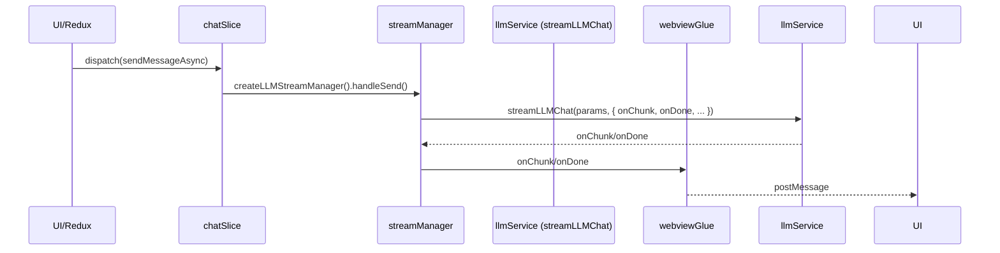

# zz-ai-chat LLM 流式请求调用链（现代工程版）

## 1. 总览

本项目采用分层解耦的 LLM 流式请求架构，支持多端（Web/Electron）、多模型、多工具链、流式消息、工具调用、OCR/图片等后处理 glue，便于扩展和维护。

---

## 2. 分层结构与职责

### 2.1 UI/Redux 层（web/src/store/chatSlice.ts）
- 负责参数组装、状态管理、UI glue
- 只调度 createLLMStreamManager，传递参数对象
- 不关心底层流式细节

### 2.2 业务 glue 层（engine/stream/streamManager.ts）
- 负责 glue 业务流、消息管理、参数组装
- 只调用 streamLLMChat，onChunk/onDone glue 到消息管理器和 redux
- 工具链 glue、分片处理等可用 ToolCallAccumulator
- 可选 glue 到 webview-glue/electron-glue

### 2.3 LLM 请求 glue 层（engine/service/llmService.ts）
- 只负责底层 LLM 请求、流式消费
- 无状态 async function（streamLLMChat）
- 支持自定义 fetch、工具链 glue、消息后处理 glue、proxy
- 预留 postProcessMessages、ocrService、imageService 等 glue 接口
- currentStream 支持流式中止

### 2.4 多端 glue 层（web/src/glue/webview-glue.ts、electron/webview-glue.ts）
- 只负责多端 postMessage glue
- createWebviewLLMGlue/createElectronWebviewGlue 工厂，onChunk/onDone/onAbort glue 到 UI
- 业务层只需 glue onChunk/onDone 到此 glue，无需关心多端细节

### 2.5 工具链/后处理 glue 层（engine/service/ocr.service.ts、image.service.ts 等）
- 只负责 OCR、图片等工具链 glue
- 通过 postProcessMessages/ocrService/imageService 注入到 llmService
- 业务层无需关心工具链实现

---

## 3. 关键接口/调用点

- chatSlice.ts
  ```ts
  const streamManager = createLLMStreamManager({
    // ...参数
    onAddMessage: ...,
    onUpdateLastMessage: ...,
    onError: ...,
    // 可选 glue: ...webviewGlue.onChunk/onDone
  });
  await streamManager.handleSend(input, new AbortController().signal);
  ```

- streamManager.ts
  ```ts
  await streamLLMChat({
    baseURL,
    apiKey,
    model,
    messages,
    temperature,
    tools,
    parallelToolCalls,
    onChunk, // glue 到消息管理器/redux/webviewGlue
    onDone,  // glue 到消息管理器/redux/webviewGlue
    postProcessMessages, // glue 工具链/后处理
    ocrService, // glue OCR
    imageService, // glue 图片
    customFetch // glue 代理
  });
  ```

- llmService.ts
  ```ts
  export async function streamLLMChat({ ... }) {
    if (postProcessMessages) await postProcessMessages(messages);
    // ...如需 OCR、图片 glue，可在此调用 ocrService/imageService
    // ...openai sdk for await...of
    for await (const chunk of stream as any) {
      if (onChunk) onChunk(chunk);
    }
    if (onDone) onDone(lastChunk);
  }
  ```

- webview-glue.ts / electron-glue.ts
  ```ts
  export function createWebviewLLMGlue({ webview }) {
    return {
      onChunk: (chunk) => webview.postMessage({ ... }),
      onDone: (result) => webview.postMessage({ ... }),
      onAbort: () => webview.postMessage({ ... })
    }
  }
  ```

---

## 4. 结构图



---

## 5. 目录结构建议

```
engine/
  service/
    llmService.ts
    ocr.service.ts
    image.service.ts
    axios-fetch.ts
  stream/
    streamManager.ts
    streamHandler.ts
    streamAccumulator.ts
    README-llm-stream-calling-chain.md
web/
  src/
    store/
      chatSlice.ts
    glue/
      webview-glue.ts
      electron-glue.ts
```

---

## 6. 命名建议
- **底层 LLM 请求函数**：`streamLLMChat`、`streamChatCompletion`、`llmStreamRequest` 等，突出"流式/无状态/异步"特性。
- **业务 glue 工厂**：`createLLMStreamManager`、`createChatStreamManager` 等。
- **流式分发回调**：`onChunk`、`onDone`、`onAbort`、`onToolCall` 等。
- **工具链 glue**：`postProcessMessages`、`handleToolCall`、`ocrService`、`imageService` 等。
- **多端 glue**：`postMessageGlue`、`webviewGlue`、`electronGlue` 等。

---

## 7. 扩展点与最佳实践
- glue 层全部对象化、类型化，便于扩展和维护
- 工具链/后处理 glue 可随时插拔
- 多端 glue 只需 glue onChunk/onDone，无需关心底层细节
- 流式 glue、工具链 glue、后处理 glue、代理 glue 全链路可插拔

---

如需进一步细化 glue 层、工具链、后处理等分层方案，可继续提问！ 