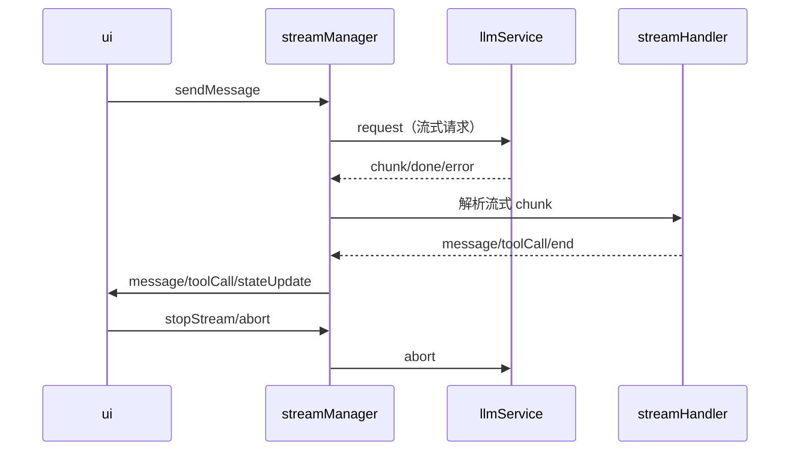

# zz-ai-chat LLM 流式请求事件驱动架构（重构版）

## 1. 总览

本项目采用事件驱动的 LLM 流式请求架构，streamManager 作为 UI 层与底层服务（如 llmService、mcpService 等）的核心连接枢纽。通过事件机制实现指令式解耦、流程可控、插件化扩展，适配多端（Web/Electron）、多后端（远程/本地）、多工具链，极大提升灵活性与可维护性。

---

## 2. 分层结构与职责（事件流重构）

### 2.1 UI/Redux 层
- 只负责发出高层事件（如 sendMessage、stopStream、registerService 等）
- 通过 dispatch/emit 事件与 streamManager 通信
- 订阅流式消息、状态、异常等事件，驱动 UI 渲染

### 2.2 streamManager（事件中心/连接层）
- 作为 UI 与底层服务的桥梁，统一事件分发与生命周期管理
- 维护事件总线，注册/注销服务（如 llmService、mcpService）
- 接收 UI 层指令事件，转发给对应服务
- 监听底层服务流式事件（如 chunk、done、error、toolCall），统一分发给 UI
- 根据 streamHandler 解析结果动态驱动流程（如自动 toolCall、流式终止、异常回退等）
- 支持插件化扩展（如工具链、后处理、代理等）

### 2.3 llmService/mcpService（底层服务）
- 只负责具体流式请求的发起、消费、终止
- 通过事件接口与 streamManager 通信（如 onChunk、onDone、onError、onAbort）
- 支持多后端注册与切换
- 预留 glue 接口（如 postProcessMessages、ocrService、imageService 等）

### 2.4 streamHandler（流式解析与流程控制）
- 负责解析底层流式响应，抽象为高层事件（如 message、toolCall、end、error）
- 根据解析结果驱动流程（如遇到 toolCall 自动发起工具请求，遇到 end 自动收尾）
- 可插拔自定义解析器，适配不同协议/后端

### 2.5 多端适配层（webview-glue/electron-glue）
- 只负责多端事件 glue（如 postMessage、IPC）
- 事件机制天然适配多端，UI 层无需关心底层实现

---

## 3. 事件机制与接口设计

### 3.1 事件类型（建议）
- UI -> streamManager：sendMessage、stopStream、registerService、unregisterService、toolCall、abort、retry 等
- streamManager -> UI：message、chunk、done、error、toolCall、stateUpdate、serviceRegistered、serviceError 等
- streamManager <-> 服务：request、chunk、done、error、abort、toolCall 等

### 3.2 事件流典型流程



---

## 4. 插件化与扩展点

- **服务注册/注销**：支持动态注册/切换 llmService、mcpService、本地/远端等多后端
- **工具链/后处理 glue**：如 ocr、图片、代理等，通过事件机制注入
- **流式解析器**：streamHandler 可插拔，适配不同协议/后端
- **多端 glue**：事件机制天然适配 web/electron/小程序等多端
- **异常与流程控制**：所有异常、终止、回退均事件化，便于统一处理

---

## 5. 目录结构建议

```
engine/
  stream/
    streamManager.ts   # 事件中心/连接层
    streamHandler.ts   # 流式解析与流程控制
    streamAccumulator.ts
    README-llm-stream-calling-chain.md
  service/
    llmService.ts      # 底层 LLM 请求服务
    mcpService.ts      # MCP 工具服务（可选）
    ocr.service.ts
    image.service.ts
web/
  src/
    store/
      chatSlice.ts     # UI/Redux 事件发起
    glue/
      webview-glue.ts
      electron-glue.ts
```

---

## 6. 最佳实践与注意事项

- 事件类型、payload 结构需标准化，建议用 TypeScript 类型统一约束
- streamManager 只做事件分发和生命周期管理，具体实现交给服务/插件
- UI 层只需订阅/发射事件，彻底解耦底层
- 插件/工具链/多端 glue 全部事件化、对象化，便于扩展
- 流程控制、异常处理、状态同步全部事件驱动，保证一致性和健壮性

---

## 7. 总结

本架构以事件驱动为核心，streamManager 作为连接枢纽，极大提升了 UI 与底层服务的解耦、扩展性和多端适配能力。所有流式请求、工具链、后处理、异常、流程控制均通过事件流统一管理，是现代 AI 聊天/多端应用的最佳实践。

如需进一步细化事件协议、代码结构或插件机制，欢迎补充需求！ 