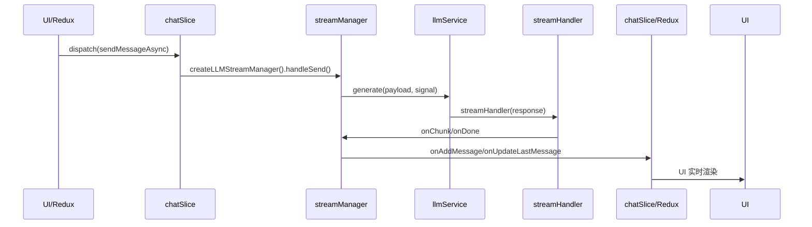

# zz-ai-chat LLM 流式消息发送调用链分析

## 1. Redux 入口（web/src/store/chatSlice.ts）

- **发起端**：UI 组件（如 Chat/InputSender）调用 `dispatch(sendMessageAsync({ chatId, input }))`
- **异步 action**：`sendMessageAsync`（redux-thunk）
  - 组装参数（chatId、input、llmConfig、activeLLM 等）
  - 追加用户消息到 redux
  - **调用 engine 层 glue**：`createLLMStreamManager({...}).handleSend(input, signal)`

---

## 2. engine/stream/streamManager.ts

- **createLLMStreamManager**：业务 glue 工厂，负责 glue redux/engine/llmService
  - 组装 initialMessages、llmConfig、activeLLM、tools、回调等
  - 返回带有 handleSend 的 manager

- **handleSend**（核心 glue 逻辑）：
  1. 组装消息队列，追加 user/assistant/system 消息
  2. 构建 LLM 请求参数（model、apiKey、baseUrl、tools、systemPrompt 等）
  3. **调用 llmService.generate** 发起流式请求
  4. **流式消费 glue**（handleResponseStream）：
     - onChunk 回调：  
       - 更新消息内容到消息管理器和 redux
       - 如有 tools，实例化 ToolCallAccumulator，处理 tool_calls 分片、tool_content glue
     - onDone 回调：  
       - 更新最终消息内容到消息管理器和 redux
       - 触发 onStreamEnd

---

## 3. engine/service/llmService.ts

- **generate**：底层 LLM 请求 glue
  - 用 fetch 直接请求 LLM 服务（如 OpenAI 兼容接口）
  - 返回 Response，交由 streamHandler 解析

---

## 4. engine/stream/streamHandler.ts

- **streamHandler**：将 fetch Response 解析为 chunk（ExtendedChatCompletionChunk）
- **handleResponseStream**：消费 chunk，逐步回调 onChunk/onDone

---

## 5. 消息流向与 UI glue

- onChunk/onDone glue 到 redux（addMessage、updateLastMessage），驱动 UI 实时展示流式消息
- 如有 tool call，tool call glue 也在 onChunk 内部处理

---

## 6. 总结（调用链图）

---

## 7. 关键分层说明

- **Redux/业务 glue**：只负责参数组装、状态管理、UI glue
- **engine/streamManager**：只 glue 业务流、消息管理、tool call glue
- **engine/llmService/streamHandler**：只负责底层请求和流式解析

---

如需更详细的参数流、类型流、或某一层 glue 细节说明，可继续提问！ 