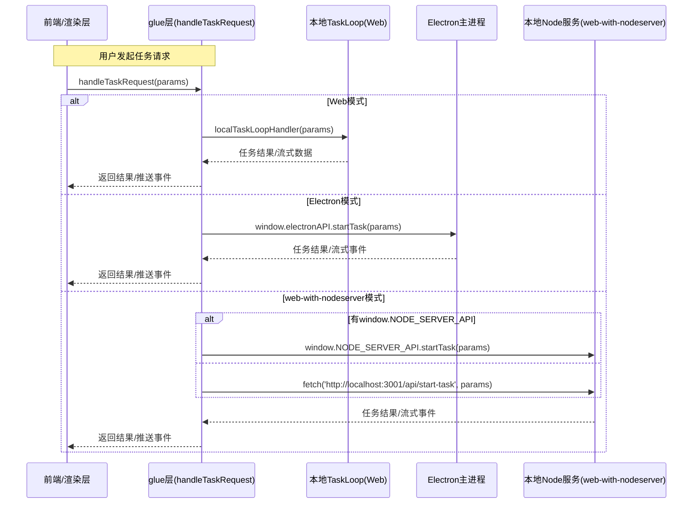

# 多端打包模式下的运行时分发 switch-case 示例

以下为典型的三端（Web/StreamableHTTP、Electron、Server Side Client）运行时分发代码片段，可用于中间件、API glue 或入口文件：

```typescript
// 假设在 src/engine/entrypoint.ts 或中间件等 glue 层

// 新增模式：web-with-nodeserver，表示 Web 前端通过 HTTP/WebSocket 调用本地 Node 服务（如本地部署的 streamablehttp/mcp server）
type Mode = 'web' | 'electron' | 'ssc' | 'web-with-nodeserver';

function detectMode(): Mode {
  if (typeof window !== 'undefined' && (window as any).electronAPI) {
    return 'electron';
  }
  if (typeof process !== 'undefined' && process.env.SSC_MODE === 'true') {
    return 'ssc';
  }
  if (typeof window !== 'undefined' && (window as any).NODE_SERVER_API) {
    // 例如通过 preload/contextBridge 或全局变量注入
    return 'web-with-nodeserver';
  }
  return 'web'; // 默认 web/streamablehttp
}

export async function handleTaskRequest(params: any) {
  switch (detectMode()) {
    case 'web':
      // 直接调用本地 engine/service/task-loop 逻辑
      // 适用于浏览器/streamablehttp 打包
      return await localTaskLoopHandler(params);
    case 'electron':
      // 通过 window.electronAPI 发送 IPC 请求到主进程
      return await window.electronAPI.startTask(params);
    case 'ssc':
      // 通过 HTTP/WebSocket 调用 SSC 服务端 API
      return await fetch('/api/start-task', {
        method: 'POST',
        headers: { 'Content-Type': 'application/json' },
        body: JSON.stringify(params)
      }).then(res => res.json());
    case 'web-with-nodeserver':
      // 通过本地 Node 服务 API 调用
      // 例如 window.NODE_SERVER_API 或直接 fetch 本地端口
      if ((window as any).NODE_SERVER_API) {
        return await (window as any).NODE_SERVER_API.startTask(params);
      }
      // 或 fallback 到本地端口
      return await fetch('http://localhost:3001/api/start-task', {
        method: 'POST',
        headers: { 'Content-Type': 'application/json' },
        body: JSON.stringify(params)
      }).then(res => res.json());
    default:
      throw new Error('Unknown runtime mode');
  }
}
```

## 运行时分发时序图



## 说明
- `detectMode` 可根据运行环境自动判断当前模式（可扩展更复杂的检测逻辑）
- `web`：直接调用本地 engine/service/task-loop，适用于浏览器/streamablehttp
- `electron`：通过 `window.electronAPI` 走 IPC
- `ssc`：通过 HTTP/WebSocket 调用服务端
- `web-with-nodeserver`：通过本地 Node 服务 API 调用
- 入口 glue 层、Redux middleware、API 层等均可用此 switch-case 实现多端兼容

---
如需更详细的入口文件结构或打包配置建议，可进一步细化。
