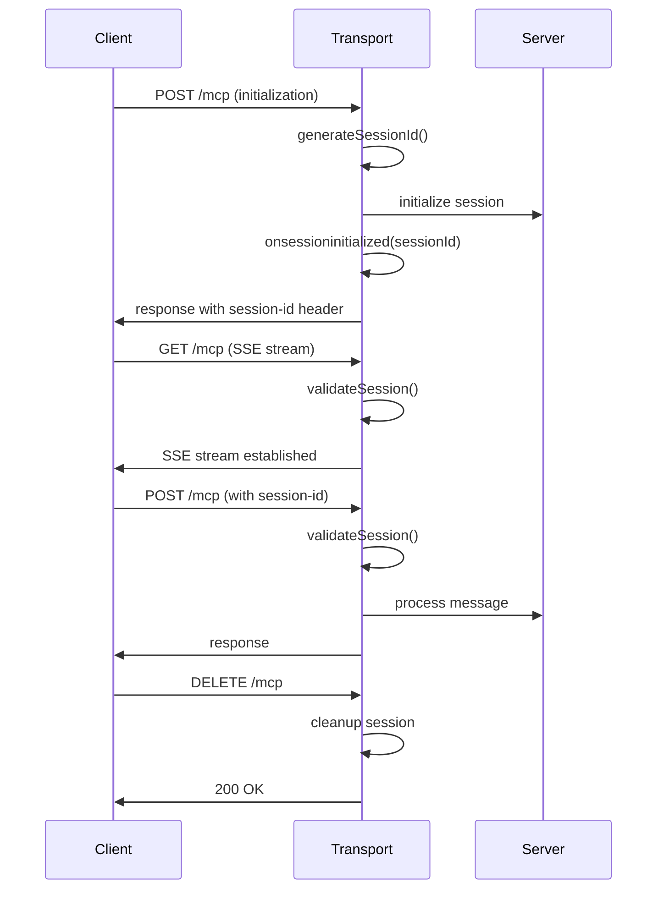

# StreamableHTTPServerTransport 源码分析与使用指南

## 概述

`StreamableHTTPServerTransport` 是MCP (Model Context Protocol) SDK中的核心服务器传输层实现，支持基于HTTP的流式通信。它实现了MCP Streamable HTTP传输规范，支持SSE (Server-Sent Events) 流和直接HTTP响应两种模式。

## 核心架构分析

### 1. 接口定义

```typescript
export declare class StreamableHTTPServerTransport implements Transport {
    // 私有属性
    private sessionIdGenerator;      // 会话ID生成器
    private _started;               // 启动状态
    private _streamMapping;         // 流映射管理
    private _requestToStreamMapping; // 请求到流的映射
    private _requestResponseMap;    // 请求响应映射
    private _initialized;           // 初始化状态
    private _enableJsonResponse;    // 是否启用JSON响应
    private _standaloneSseStreamId; // 独立SSE流ID
    private _eventStore?;           // 事件存储(可选)
    private _onsessioninitialized?; // 会话初始化回调

    // 公共属性
    sessionId?: string;             // 会话ID
    onclose?: () => void;           // 关闭回调
    onerror?: (error: Error) => void; // 错误回调
    onmessage?: (message: JSONRPCMessage, extra?: { authInfo?: AuthInfo }) => void; // 消息回调
}
```

### 2. 配置选项分析

```typescript
export interface StreamableHTTPServerTransportOptions {
    // 核心配置
    sessionIdGenerator: (() => string) | undefined;  // 会话ID生成器
    onsessioninitialized?: (sessionId: string) => void; // 会话初始化回调
    enableJsonResponse?: boolean;     // 启用JSON响应模式
    eventStore?: EventStore;          // 事件存储(用于恢复功能)
}
```

## 工作模式分析

### 1. Stateful Mode (有状态模式)

```typescript
// 特点：服务器管理会话状态
const statefulTransport = new StreamableHTTPServerTransport({
  sessionIdGenerator: () => randomUUID(), // 提供会话ID生成器
  onsessioninitialized: (sessionId) => {
    console.log(`会话初始化: ${sessionId}`);
  }
});
```

**行为特征：**
- ✅ 服务器生成并管理session ID
- ✅ session ID包含在响应头中
- ✅ 维护内存中的连接状态和消息历史
- ✅ 无效session ID的请求被拒绝(404)
- ✅ 无session ID的非初始化请求被拒绝(400)

### 2. Stateless Mode (无状态模式)

```typescript
// 特点：无会话状态管理
const statelessTransport = new StreamableHTTPServerTransport({
  sessionIdGenerator: undefined, // 明确禁用会话管理
});
```

**行为特征：**
- ✅ 不生成或验证session ID
- ✅ 响应中不包含session ID
- ✅ 不进行会话验证
- ✅ 适合简单的请求/响应场景

## 核心方法分析

### 1. handleRequest - 请求处理核心

```typescript
handleRequest(
    req: IncomingMessage & { auth?: AuthInfo }, 
    res: ServerResponse, 
    parsedBody?: unknown
): Promise<void>
```

**功能：**
- 统一处理GET、POST、DELETE等HTTP请求
- 根据请求方法分发到不同的处理器
- 验证协议版本和会话状态

### 2. 私有方法职责分析

```typescript
// HTTP方法处理器
private handleGetRequest     // 处理GET请求(SSE流)
private handlePostRequest    // 处理POST请求(JSON-RPC消息)
private handleDeleteRequest  // 处理DELETE请求(终止会话)
private handleUnsupportedRequest // 处理不支持的请求方法

// 辅助功能
private validateSession      // 验证会话ID
private validateProtocolVersion // 验证协议版本
private writeSSEEvent       // 写SSE事件
private replayEvents        // 重放事件(恢复功能)
```

## 会话管理机制

### 1. 会话生命周期



### 2. 会话验证逻辑

```typescript
// 伪代码示例
private validateSession(req: IncomingMessage): boolean {
    if (!this.sessionIdGenerator) {
        return true; // 无状态模式，跳过验证
    }
    
    const sessionId = req.headers['mcp-session-id'];
    if (!sessionId) {
        return false; // 有状态模式必须有session ID
    }
    
    return this.isValidSession(sessionId);
}
```

## 错误处理机制

### 1. 常见错误类型

```typescript
// 协议版本不匹配
{
  "jsonrpc": "2.0",
  "error": {
    "code": -32600,
    "message": "Invalid Request: Unsupported protocol version"
  },
  "id": null
}

// 会话已初始化
{
  "jsonrpc": "2.0", 
  "error": {
    "code": -32600,
    "message": "Invalid Request: Server already initialized"
  },
  "id": null
}

// 无效会话ID
{
  "jsonrpc": "2.0",
  "error": {
    "code": -32600, 
    "message": "Invalid Request: Invalid session ID"
  },
  "id": null
}
```

## 实际使用模式

### 1. 单实例共享模式 (❌ 不推荐)

```typescript
// 问题：所有客户端共享同一个transport实例
const transport = new StreamableHTTPServerTransport({
  sessionIdGenerator: () => Date.now().toString(),
});
await mcpServer.connect(transport);

app.post('/mcp', async (req, res) => {
  await transport.handleRequest(req, res, req.body); // 共享实例
});
```

**问题：**
- 会话冲突
- 状态混乱
- "Server already initialized" 错误

### 2. 多实例隔离模式 (✅ 推荐)

```typescript
// 解决方案：为每个会话创建独立transport
const transports = new Map<string, StreamableHTTPServerTransport>();

app.post('/mcp', async (req, res) => {
  const sessionId = req.headers['mcp-session-id'] as string;
  
  let transport = transports.get(sessionId);
  if (!transport) {
    // 创建新transport和服务器实例
    transport = new StreamableHTTPServerTransport({
      sessionIdGenerator: () => `session-${Date.now()}-${Math.random()}`,
      onsessioninitialized: (id) => {
        console.log(`新会话创建: ${id}`);
      }
    });
    
    const serverInstance = new McpServer({...});
    await setupServer(serverInstance);
    await serverInstance.connect(transport);
    
    transports.set(transport.sessionId!, transport);
    
    // 清理断开的连接
    transport.onclose = () => {
      if (transport.sessionId) {
        transports.delete(transport.sessionId);
      }
    };
  }
  
  await transport.handleRequest(req, res, req.body);
});
```

### 3. 无状态模式 (✅ 适合简单场景)

```typescript
// 简单的无状态实现
const transport = new StreamableHTTPServerTransport({
  sessionIdGenerator: undefined, // 禁用会话管理
  enableJsonResponse: true       // 使用JSON响应而非SSE
});

app.post('/mcp', async (req, res) => {
  await transport.handleRequest(req, res, req.body);
});
```

## 恢复功能 (Resumability)

### 1. EventStore接口

```typescript
interface EventStore {
  // 存储事件用于后续恢复
  storeEvent(streamId: StreamId, message: JSONRPCMessage): Promise<EventId>;
  
  // 重放指定事件ID之后的事件
  replayEventsAfter(lastEventId: EventId, { send }): Promise<StreamId>;
}
```

### 2. 实现恢复功能

```typescript
// 内存事件存储实现示例
class MemoryEventStore implements EventStore {
  private events = new Map<EventId, { streamId: StreamId, message: JSONRPCMessage }>();
  private eventCounter = 0;
  
  async storeEvent(streamId: StreamId, message: JSONRPCMessage): Promise<EventId> {
    const eventId = `event-${++this.eventCounter}`;
    this.events.set(eventId, { streamId, message });
    return eventId;
  }
  
  async replayEventsAfter(lastEventId: EventId, { send }): Promise<StreamId> {
    // 实现事件重放逻辑
    for (const [eventId, { streamId, message }] of this.events) {
      if (eventId > lastEventId) {
        await send(eventId, message);
      }
    }
    return streamId;
  }
}

// 使用恢复功能
const transport = new StreamableHTTPServerTransport({
  sessionIdGenerator: () => randomUUID(),
  eventStore: new MemoryEventStore()
});
```

## 最佳实践

### 1. 生产环境配置

```typescript
// 生产环境推荐配置
const transport = new StreamableHTTPServerTransport({
  sessionIdGenerator: () => {
    // 使用加密安全的UUID
    return crypto.randomUUID();
  },
  onsessioninitialized: (sessionId) => {
    // 记录会话创建
    logger.info(`MCP会话创建: ${sessionId}`);
    
    // 可选：将会话信息存储到数据库
    sessionStore.create(sessionId, {
      createdAt: new Date(),
      lastActivity: new Date()
    });
  },
  enableJsonResponse: false, // 默认使用SSE流
  eventStore: new RedisEventStore() // 使用Redis存储事件
});
```

### 2. 错误处理和监控

```typescript
transport.onerror = (error) => {
  logger.error('MCP Transport错误:', error);
  
  // 可选：发送到监控系统
  monitoring.recordError('mcp_transport_error', error);
};

transport.onclose = () => {
  logger.info('MCP Transport连接关闭');
  
  // 清理资源
  if (transport.sessionId) {
    sessionStore.delete(transport.sessionId);
  }
};
```

### 3. 性能优化

```typescript
// 连接池管理
class TransportPool {
  private pool = new Map<string, StreamableHTTPServerTransport>();
  private maxConnections = 1000;
  
  getOrCreate(sessionId: string): StreamableHTTPServerTransport {
    if (this.pool.size >= this.maxConnections) {
      throw new Error('连接数超过限制');
    }
    
    let transport = this.pool.get(sessionId);
    if (!transport) {
      transport = this.createTransport(sessionId);
      this.pool.set(sessionId, transport);
      
      // 设置清理
      transport.onclose = () => {
        this.pool.delete(sessionId);
      };
    }
    
    return transport;
  }
  
  private createTransport(sessionId: string): StreamableHTTPServerTransport {
    return new StreamableHTTPServerTransport({
      sessionIdGenerator: () => sessionId,
      // ... 其他配置
    });
  }
}
```

## 总结

`StreamableHTTPServerTransport` 是一个功能强大但需要正确使用的组件：

### ✅ 优势
- 支持有状态和无状态两种模式
- 内置会话管理和验证
- 支持SSE流和JSON响应
- 提供恢复功能
- 完整的错误处理

### ⚠️ 注意事项
- 每个会话需要独立的transport实例
- 有状态模式需要正确的会话管理
- 需要处理连接清理避免内存泄漏
- 生产环境需要考虑安全性和性能

### 🎯 关键要点
1. **会话隔离**: 为每个客户端会话创建独立的transport实例
2. **资源清理**: 正确处理连接断开和资源清理
3. **错误处理**: 实现完整的错误处理和监控
4. **安全性**: 使用安全的会话ID生成器
5. **性能**: 考虑连接池和资源限制
