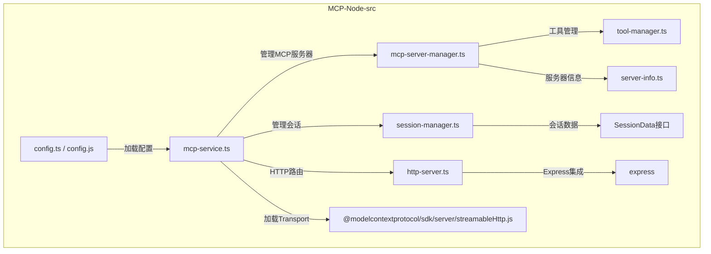

# MCP-Node 文件模块架构说明

- **config.ts / config.js**：配置加载与管理。
- **mcp-service.ts**：服务主入口，协调各模块。
- **session-manager.ts**：会话生命周期管理。
- **mcp-server-manager.ts**：MCP服务器实例与工具管理。
- **tool-manager.ts**：工具注册与调用。
- **server-info.ts**：服务器元信息。
- **http-server.ts**：Express集成与路由。
- **SessionData接口**：单个会话的数据结构。
- **@modelcontextprotocol/sdk/server/streamableHttp.js**：底层Transport实现。
- **express**：HTTP服务框架。

> 该图展示了 mcp-node/src 目录下主要 TypeScript 文件的依赖与协作关系，便于理解整体架构和模块职责。
