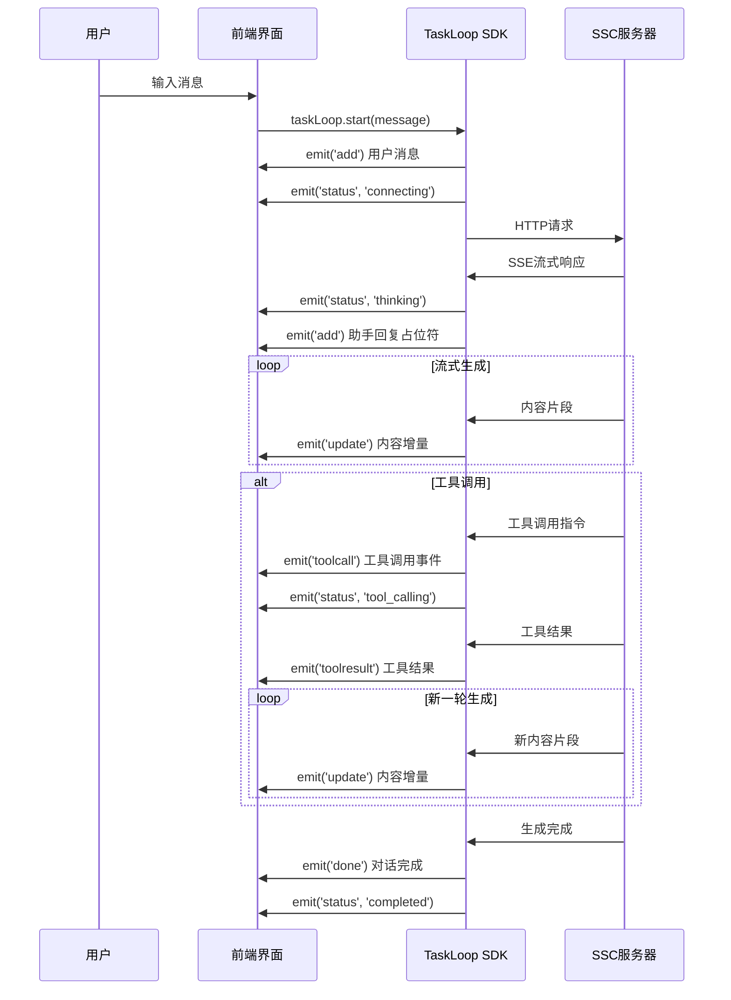

# TaskLoop SSC-SDK 使用指南

TaskLoop SDK提供了完整的AI聊天解决方案，支持SSC (server-side-clientputing) 模式部署。

本文档面向前端开发者，提供详细的SDK集成指南、事件处理机制和最佳实践。

## 架构概览

### SSC模式架构

```
前端应用                SSC服务器              AI服务
┌─────────────┐    ┌──────────────┐    ┌─────────────┐
│ TaskLoop SDK │───▶│  LLM代理      │───▶│ OpenAI等     │
│ 事件驱动    │    │  工具代理     │───▶│ MCP工具服务  │
│ 框架无关    │◀───│  HTTP/SSE API │    │ 第三方API   │
└─────────────┘    └──────────────┘    └─────────────┘
```

**核心优势**：
- **安全性**：API密钥存储在服务端
- **可扩展**：支持多种LLM提供商和工具
- **框架无关**：适用于Vue、React、Angular等
- **实时性**：基于SSE的流式响应

## 环境准备

### 1. SSC服务器配置

```bash
# ssc-server/.env
DEEPSEEK_API_KEY=your-api-key
MCP_SERVER_URL=http://localhost:8000/mcp  # 可选
ALLOWED_ORIGINS=http://localhost:3000     # 跨域配置
PORT=8080
```

### 2. 启动服务

```bash
# 启动SSC服务器
pnpm run dev:ssc-server

# 启动MCP工具服务（可选）
cd mcp-python && python server.py
```

## SDK核心API

### 1. 构建和导入

```bash
# 构建SDK
pnpm run build:sdk
```

```javascript
// ES模块导入
import { createTaskLoop } from './lib/index.js'
```

### 2. 创建实例

```javascript
const taskLoop = createTaskLoop({
  chatId: 'unique-chat-id',
  history: [], // 可选：历史消息数组
  config: {
    // 基础配置
    model: 'deepseek-chat',
    temperature: 0.7,
    sscApiBaseUrl: 'http://localhost:8080', // 必需：SSC服务器地址
    
    // 工具配置（可选）
    tools: [
      {
        type: 'function',
        function: {
          name: 'get_weather',
          description: '获取天气信息',
          parameters: {
            type: 'object',
            properties: {
              city: { type: 'string', description: '城市名称' }
            },
            required: ['city']
          }
        }
      }
    ]
  }
})
```

### 配置选项详解

#### 基础配置参数

```typescript
interface TaskLoopConfig {
  // 必需配置
  model: string                // 模型名称
  sscApiBaseUrl: string        // SSC 服务器地址
  
  // LLM 参数配置
  temperature?: number         // 采样温度 (0.0-2.0)，默认 0.7
  maxTokens?: number           // 最大输出 token 数，默认模型限制
  topP?: number                // 核采样参数 (0.0-1.0)，默认 0.9
  frequencyPenalty?: number    // 频率惩罚 (-2.0-2.0)，默认 0
  presencePenalty?: number     // 存在惩罚 (-2.0-2.0)，默认 0
  
  // 工具配置
  tools?: Tool[]               // 可用工具列表
  parallelToolCalls?: boolean  // 是否允许并行工具调用，默认 false
  toolChoice?: 'auto' | 'none' | { type: 'function', function: { name: string } }
  
  // 流式配置  
  stream?: boolean             // 是否启用流式响应，默认 true
  
  // 超时配置
  timeout?: number             // 请求超时时间（毫秒），默认 60000
  
  // 高级配置
  systemPrompt?: string        // 系统提示词
  contextWindow?: number       // 上下文窗口大小
  
  // 其他模型特定参数
  [key: string]: any
}
```

#### 支持的模型列表

| 提供商 | 模型名称 | 描述 |
|---------|---------|----------|
| DeepSeek | `deepseek-chat` | 通用聊天模型 |
| DeepSeek | `deepseek-coder` | 代码生成模型 |
| OpenAI | `gpt-4` | GPT-4 最新版本 |
| OpenAI | `gpt-4-turbo` | GPT-4 Turbo 版本 |
| OpenAI | `gpt-3.5-turbo` | GPT-3.5 Turbo 版本 |
| Anthropic | `claude-3-opus` | Claude 3 Opus |
| Anthropic | `claude-3-sonnet` | Claude 3 Sonnet |

#### 配置示例

```javascript
// 基础配置
const basicConfig = {
  model: 'deepseek-chat',
  temperature: 0.7,
  sscApiBaseUrl: 'http://localhost:8080'
}

// 高级配置
const advancedConfig = {
  model: 'gpt-4',
  temperature: 0.3,
  maxTokens: 4000,
  topP: 0.9,
  frequencyPenalty: 0.5,
  presencePenalty: 0.2,
  systemPrompt: '你是一个专业的AI助手。',
  parallelToolCalls: true,
  timeout: 120000, // 2分钟超时
  sscApiBaseUrl: 'https://api.example.com'
}

// 代码生成专用配置
const codingConfig = {
  model: 'deepseek-coder',
  temperature: 0.1, // 低温度，更精准
  maxTokens: 8000,
  systemPrompt: '你是一个专业的程序员，请提供高质量的代码。',
  sscApiBaseUrl: 'http://localhost:8080'
}
```

### 3. 事件订阅

TaskLoop采用事件驱动架构，所有交互通过事件处理：

```javascript
const unsubscribe = taskLoop.subscribe((event) => {
  console.log('事件:', event.type, event)
})

// 清理订阅（组件卸载时）
unsubscribe()
```

### 4. 启动对话

```javascript
// 开始对话
await taskLoop.start('用户输入的消息')

// 中断对话
taskLoop.abortTask()
```

## 事件系统详解

TaskLoop通过事件流提供实时的对话状态和内容更新：

## 事件系统详解

TaskLoop采用事件驱动架构，通过8种核心事件类型提供实时的对话状态和内容更新：

```typescript
// 核心事件类型定义
export type TaskLoopEvent =
  | { type: 'add'; message: EnrichedMessage; cardStatus?: string }
  | { type: 'update'; message: IncrementalMessage; cardStatus?: string }
  | { type: 'status'; status: string; cardStatus?: string }
  | { type: 'toolcall'; toolCall: ToolCall; cardStatus?: string }
  | { type: 'toolresult'; toolCallId: string; result: string; error?: string }
  | { type: 'done'; taskId: string; result: any; cardStatus?: string }
  | { type: 'error'; taskId: string; error: string; cardStatus?: string }
  | { type: 'abort'; taskId: string; cardStatus?: string };
```

### 事件类型说明

| 事件类型 | 触发时机 | 主要用途 | 数据结构 |
|---------|---------|----------|----------|
| `add` | 新消息添加 | 显示消息气泡 | `{ message: EnrichedMessage }` |
| `update` | 内容流式更新 | 实时显示生成内容 | `{ message: { content_delta: string } }` |
| `status` | 状态变化 | 显示处理状态 | `{ status: string }` |
| `toolcall` | 工具调用开始 | 显示工具执行过程 | `{ toolCall: ToolCall }` |
| `toolresult` | 工具执行完成 | 显示工具结果 | `{ toolCallId: string, result: string }` |
| `done` | 对话轮次完成 | 更新最终状态 | `{ taskId: string, result: any }` |
| `error` | 发生错误 | 错误处理和提示 | `{ taskId: string, error: string }` |
| `abort` | 对话被中断 | 中断状态处理 | `{ taskId: string }` |

### 事件流转流程

一次完整对话的事件时序：



### 事件处理示例

```javascript
taskLoop.subscribe((event) => {
  switch (event.type) {
    case 'add':
      // 新消息：用户消息或助手消息占位符
      // event.message: { id, role, content, timestamp }
      addMessageToUI(event.message)
      break
      
    case 'update':
      // 流式更新：仅包含增量内容
      // event.message: { content_delta, reasoning_delta }
      updateLastMessage(event.message.content_delta)
      break
      
    case 'status':
      // 状态变化：connecting → thinking → generating → tool_calling → completed
      // event: { status, cardStatus }
      updateStatus(event.status)
      break
      
    case 'toolcall':
      // 工具调用：显示正在使用的工具
      // event.toolCall: { id, function: { name, arguments } }
      showToolCall(event.toolCall.function.name)
      break
      
    case 'toolresult':
      // 工具结果：显示工具执行结果
      // event: { toolCallId, result, error }
      showToolResult(event.result)
      break
      
    case 'done':
      // 完成：对话轮次结束
      // event: { role, content, tool_calls, id }
      finalizeMessage(event)
      break
      
    case 'error':
      // 错误：显示错误信息
      // event: { error }
      showError(event.error)
      break
  }
})
```

## 动态工具配置

### 1. 从SSC服务器获取工具

```javascript
// 获取可用工具列表
async function loadTools() {
  const response = await fetch('http://localhost:8080/api/mcp/tools')
  const { tools } = await response.json()
  return tools
}

// 转换为OpenAI工具格式
function convertToOpenAITools(mcpTools) {
  return mcpTools.map(tool => ({
    type: 'function',
    function: {
      name: tool.name,
      description: tool.description,
      parameters: tool.inputSchema
    }
  }))
}

// 使用动态工具创建TaskLoop
const tools = await loadTools()
const taskLoop = createTaskLoop({
  config: {
    tools: convertToOpenAITools(tools),
    // ... 其他配置
  }
})
```

### 2. 工具调用流程

```
1. LLM决定调用工具 → toolcall事件
2. SSC服务器执行工具 → 内部处理
3. 返回工具结果 → toolresult事件  
4. LLM处理结果生成回复 → update/done事件
```

## 框架集成示例

### Vue.js 集成

```javascript
// Vue组件
export default {
  data() {
    return {
      messages: [],
      taskLoop: null,
      unsubscribe: null
    }
  },
  
  async mounted() {
    this.taskLoop = createTaskLoop({
      chatId: 'vue-chat',
      config: { sscApiBaseUrl: 'http://localhost:8080' }
    })
    
    this.unsubscribe = this.taskLoop.subscribe(this.handleEvent)
  },
  
  beforeDestroy() {
    this.unsubscribe?.()
  },
  
  methods: {
    handleEvent(event) {
      // 处理事件更新UI
    },
    
    async sendMessage(text) {
      await this.taskLoop.start(text)
    }
  }
}
```

### Redux/Vuex 状态管理集成

对于大型应用，推荐将 TaskLoop 事件与状态管理库集成：

#### Redux 中间件集成

```javascript
// Redux 中间件中的事件处理
const taskLoopMiddleware = (storeAPI) => (next) => async (action) => {
  if (sendMessage.match(action)) {
    const { chatId, input } = action.payload
    const taskLoop = createTaskLoop({ 
      chatId, 
      config: { 
        model: 'deepseek-chat',
        sscApiBaseUrl: 'http://localhost:8080'
      } 
    })
    
    // 事件监听和 Redux action 映射
    const unsubscribe = taskLoop.subscribe((event) => {
      switch(event.type) {
        case 'add':
          storeAPI.dispatch(addMessage({ chatId, message: event.message }))
          break
        case 'update':
          storeAPI.dispatch(patchLastAssistantMessage({ 
            chatId, 
            patch: event.message 
          }))
          break
        case 'status':
          storeAPI.dispatch(setMessageCardStatus({ 
            chatId, 
            status: event.cardStatus 
          }))
          break
        case 'toolcall':
          storeAPI.dispatch(setToolCallState({ 
            chatId, 
            toolCall: event.toolCall 
          }))
          break
        case 'toolresult':
          storeAPI.dispatch(updateToolCallState({ 
            chatId,
            toolCallId: event.toolCallId,
            result: event.result
          }))
          break
        case 'done':
          storeAPI.dispatch(setIsGenerating({ chatId, value: false }))
          storeAPI.dispatch(setMessageCardStatus({ chatId, status: 'stable' }))
          unsubscribe() // 自动清理
          break
        case 'error':
          storeAPI.dispatch(setError({ chatId, error: event.error }))
          unsubscribe() // 自动清理
          break
      }
    })
    
    await taskLoop.start(input)
  }
  return next(action)
}
```

#### Vuex 集成

```javascript
// Vuex store 中的 TaskLoop 集成
const chatModule = {
  namespaced: true,
  state: {
    messages: {},
    isGenerating: {},
    taskLoops: new Map()
  },
  mutations: {
    ADD_MESSAGE(state, { chatId, message }) {
      if (!state.messages[chatId]) {
        Vue.set(state.messages, chatId, [])
      }
      state.messages[chatId].push(message)
    },
    UPDATE_LAST_MESSAGE(state, { chatId, patch }) {
      const messages = state.messages[chatId]
      if (messages && messages.length > 0) {
        const lastMessage = messages[messages.length - 1]
        if (patch.content_delta) {
          lastMessage.content += patch.content_delta
        }
      }
    },
    SET_GENERATING(state, { chatId, value }) {
      Vue.set(state.isGenerating, chatId, value)
    }
  },
  actions: {
    async sendMessage({ commit, state }, { chatId, input }) {
      const taskLoop = createTaskLoop({
        chatId,
        config: { 
          model: 'deepseek-chat',
          sscApiBaseUrl: 'http://localhost:8080'
        }
      })
      
      const unsubscribe = taskLoop.subscribe((event) => {
        switch(event.type) {
          case 'add':
            commit('ADD_MESSAGE', { chatId, message: event.message })
            break
          case 'update':
            commit('UPDATE_LAST_MESSAGE', { chatId, patch: event.message })
            break
          case 'done':
            commit('SET_GENERATING', { chatId, value: false })
            unsubscribe()
            break
        }
      })
      
      // 保存 taskLoop 实例供中断使用
      state.taskLoops.set(chatId, { taskLoop, unsubscribe })
      
      await taskLoop.start(input)
    },
    
    abortMessage({ state }, { chatId }) {
      const taskLoopInfo = state.taskLoops.get(chatId)
      if (taskLoopInfo) {
        taskLoopInfo.taskLoop.abortTask()
        taskLoopInfo.unsubscribe()
        state.taskLoops.delete(chatId)
      }
    }
  }
}
```

### React集成

```javascript
import { useEffect, useState, useCallback } from 'react'
import { createTaskLoop } from './lib/index.js'

function ChatComponent() {
  const [messages, setMessages] = useState([])
  const [taskLoop, setTaskLoop] = useState(null)
  
  useEffect(() => {
    const instance = createTaskLoop({
      chatId: 'react-chat',
      config: { sscApiBaseUrl: 'http://localhost:8080' }
    })
    
    const unsubscribe = instance.subscribe(handleEvent)
    setTaskLoop(instance)
    
    return () => unsubscribe()
  }, [])
  
  const handleEvent = useCallback((event) => {
    // 处理事件更新状态
  }, [])
  
  const sendMessage = async (text) => {
    await taskLoop?.start(text)
  }
  
  return (
    // JSX组件
  )
}
```

### Vanilla JavaScript集成

```javascript
// 纯JS实现
class ChatApp {
  constructor(containerId) {
    this.container = document.getElementById(containerId)
    this.messages = []
    this.init()
  }
  
  async init() {
    this.taskLoop = createTaskLoop({
      chatId: 'vanilla-chat',
      config: { sscApiBaseUrl: 'http://localhost:8080' }
    })
    
    this.unsubscribe = this.taskLoop.subscribe(this.handleEvent.bind(this))
    this.setupUI()
  }
  
  handleEvent(event) {
    switch (event.type) {
      case 'add':
        this.addMessage(event.message)
        break
      case 'update':
        this.updateLastMessage(event.message.content_delta)
        break
      // ... 其他事件处理
    }
  }
  
  async sendMessage(text) {
    await this.taskLoop.start(text)
  }
  
  destroy() {
    this.unsubscribe?.()
  }
}
```

## MessageBridge 高级API

对于需要更细粒度控制的场景，SDK 提供了直接使用 MessageBridge 的高级 API：

### MCP 服务管理

```javascript
import { messageBridge } from '@zz-ai-chat/taskloop-sdk'

// 连接 MCP 服务
messageBridge.connectMCP(serverId, url)
messageBridge.on('done', payload => {
  // 连接成功回调
  console.log('MCP 服务连接成功:', payload)
})
messageBridge.on('error', payload => {
  // 连接失败回调
  console.error('MCP 服务连接失败:', payload)
})

// 断开 MCP 服务
messageBridge.disconnectMCP(serverId)

// 获取可用工具列表
messageBridge.listMCPTools(serverId)

// 直接调用 MCP 工具
messageBridge.callMCPTool({
  serverId: 'my-mcp-server',
  toolName: 'get_weather',
  arguments: { city: '北京' }
})
```

### 事件监听和自定义处理

```javascript
// 监听所有 MessageBridge 事件
messageBridge.on('toolcall', (payload) => {
  console.log('工具调用:', payload)
})

messageBridge.on('toolresult', (payload) => {
  console.log('工具结果:', payload)
})

messageBridge.on('status', (payload) => {
  console.log('状态变更:', payload)
})

// 取消事件监听
messageBridge.off('toolcall', handler)
```

> **说明**：MessageBridge 主要用于 TaskLoop 事件的统一处理。理论上，MCP 服务器的 connect/disconnect 操作并不属于 TaskLoop 的事件范畴，但为了统一前端的事件处理机制，也将其集成在 MessageBridge 中，便于开发者通过同一接口管理所有相关事件。

## 高级配置

### 1. 历史消息恢复

```javascript
const taskLoop = createTaskLoop({
  chatId: 'existing-chat',
  history: [
    { role: 'user', content: '你好', id: 'msg-1' },
    { role: 'assistant', content: '你好！有什么可以帮助你的吗？', id: 'msg-2' }
  ],
  config: { /* ... */ }
})
```

### 2. 多轮对话支持

```javascript
// 第一轮对话
await taskLoop.start('请帮我查询北京天气')

// 第二轮对话（自动包含历史上下文）
await taskLoop.start('那上海呢？')
```

### 3. 自定义配置

```javascript
// 禁用工具调用
const noToolsConfig = createTaskLoop({
  config: {
    model: 'gpt-4',
    temperature: 0.3,
    parallelToolCalls: false,
    toolChoice: 'none', // 禁用工具调用
    sscApiBaseUrl: 'http://localhost:8080'
  }
})

// 强制使用特定工具
const specificToolConfig = createTaskLoop({
  config: {
    model: 'deepseek-chat',
    toolChoice: {
      type: 'function',
      function: { name: 'get_weather' }
    },
    tools: [weatherTool],
    sscApiBaseUrl: 'http://localhost:8080'
  }
})

// 多语言支持配置
const multiLangConfig = createTaskLoop({
  config: {
    model: 'claude-3-sonnet',
    systemPrompt: 'You are a multilingual assistant. Respond in the same language as the user.',
    temperature: 0.7,
    contextWindow: 32000,
    sscApiBaseUrl: 'http://localhost:8080'
  }
})
```

## 错误处理

### 1. 网络错误

```javascript
taskLoop.subscribe((event) => {
  if (event.type === 'error') {
    if (event.error.includes('fetch')) {
      // 网络连接问题
      showNetworkError()
    } else if (event.error.includes('CORS')) {
      // 跨域问题
      showCORSError()
    }
  }
})
```

### 2. 服务端错误

```javascript
// 检查SSC服务器状态
async function checkServerHealth() {
  try {
    const response = await fetch('http://localhost:8080/health')
    return response.ok
  } catch {
    return false
  }
}
```

### 3. 工具调用错误

```javascript
taskLoop.subscribe((event) => {
  if (event.type === 'toolresult' && event.error) {
    console.error('工具调用失败:', event.error)
    // 显示工具执行失败提示
  }
})
```

## 部署建议

### 1. 生产环境配置

```bash
# 生产环境变量
NODE_ENV=production
PORT=8080
DEEPSEEK_API_KEY=prod-key
ALLOWED_ORIGINS=https://your-domain.com
```

### 2. 安全考虑

- API密钥仅存储在SSC服务器
- 使用HTTPS进行生产部署
- 配置正确的CORS策略
- 实现访问频率限制

### 3. 性能优化

- 启用SSE连接池
- 配置适当的超时时间
- 实现消息历史长度限制
- 使用CDN分发SDK文件

## 故障排查

| 问题 | 症状 | 解决方案 |
|-----|-----|---------|
| CORS错误 | 网络请求被阻止 | 配置`ALLOWED_ORIGINS` |
| 工具不执行 | 有工具调用意图但无`toolcall`事件 | 检查MCP服务器连接 |
| 消息不更新 | `update`事件无效果 | 检查事件处理逻辑 |
| 环境检测失败 | 使用Web模式而非SSC | 确保`sscApiBaseUrl`配置 |
| 连接超时 | 长时间无响应 | 检查网络和服务器状态 |

## API 参考

### createTaskLoop(options)

创建一个 TaskLoop 实例用于管理 AI 对话。

```typescript
function createTaskLoop(options: TaskLoopOptions): TaskLoopInstance

interface TaskLoopOptions {
  chatId: string                    // 会话唯一标识
  history?: EnrichedMessage[]       // 历史消息列表
  config: TaskLoopConfig           // 配置参数
  mcpClient?: MCPClient            // MCP 客户端（可选）
}

interface TaskLoopConfig {
  model: string                    // 模型名称（必需）
  sscApiBaseUrl: string           // SSC 服务器地址（必需）
  temperature?: number            // 采样温度 (0.0-2.0)
  maxTokens?: number              // 最大 token 数
  tools?: Tool[]                  // 工具列表
  parallelToolCalls?: boolean     // 并行工具调用
  systemPrompt?: string           // 系统提示词
  timeout?: number                // 超时时间（ms）
  [key: string]: any             // 其他参数
}
```

### TaskLoop 实例方法

#### `subscribe(callback: (event: TaskLoopEvent) => void): () => void`

订阅 TaskLoop 事件。

- **参数**: `callback` - 事件处理回调函数
- **返回**: 取消订阅的函数

```javascript
const unsubscribe = taskLoop.subscribe((event) => {
  console.log('Event:', event.type, event)
})
// 取消订阅
unsubscribe()
```

#### `start(message: string): Promise<void>`

开始一轮新的 AI 对话。

- **参数**: `message` - 用户输入的消息
- **返回**: Promise，对话开始后解析

```javascript
await taskLoop.start('你好，请介绍一下你自己')
```

#### `abortTask(): void`

中断当前进行中的对话。

```javascript
taskLoop.abortTask()
```

### MessageBridge API

用于更高级的 MCP 服务管理。

#### `connectMCP(serverId: string, url: string): void`

连接 MCP 服务。

#### `disconnectMCP(serverId: string): void`

断开 MCP 服务。

#### `listMCPTools(serverId: string): void`

获取 MCP 服务的工具列表。

#### `callMCPTool(params: MCPToolCallParams): void`

直接调用 MCP 工具。

```typescript
interface MCPToolCallParams {
  serverId: string
  toolName: string
  arguments: Record<string, any>
}
```

### 事件类型定义

```typescript
type TaskLoopEvent = 
  | { type: 'add'; message: EnrichedMessage; cardStatus?: string }
  | { type: 'update'; message: IncrementalMessage; cardStatus?: string }
  | { type: 'status'; status: string; cardStatus?: string }
  | { type: 'toolcall'; toolCall: ToolCall; cardStatus?: string }
  | { type: 'toolresult'; toolCallId: string; result: string; error?: string }
  | { type: 'done'; taskId: string; result: any; cardStatus?: string }
  | { type: 'error'; taskId: string; error: string; cardStatus?: string }
  | { type: 'abort'; taskId: string; cardStatus?: string }

interface EnrichedMessage {
  id: string
  role: 'user' | 'assistant' | 'tool' | 'system'
  content: string
  timestamp: number
  name?: string
  tool_calls?: ToolCall[]
  usage?: TokenUsage
}

interface IncrementalMessage {
  content_delta?: string          // 内容增量
  reasoning_delta?: string        // 思维过程增量
  tool_calls?: ToolCall[]         // 工具调用
}

interface ToolCall {
  id: string
  type: 'function'
  function: {
    name: string
    arguments: string
  }
}
```

### 错误处理

SDK 会通过 `error` 事件报告错误：

```javascript
taskLoop.subscribe((event) => {
  if (event.type === 'error') {
    console.error('TaskLoop Error:', event.error)
    // 处理错误逻辑
  }
})
```

常见错误类型：
- `NETWORK_ERROR`: 网络连接错误
- `TIMEOUT_ERROR`: 请求超时
- `AUTH_ERROR`: 认证失败
- `RATE_LIMIT_ERROR`: 请求频率限制
- `SERVER_ERROR`: 服务端错误
- `TOOL_ERROR`: 工具调用错误

## 最佳实践

### 1. 内存管理

```javascript
// 组件销毁时清理资源
class ChatComponent {
  constructor() {
    this.unsubscribes = new Map()
  }
  
  createChat(chatId) {
    const taskLoop = createTaskLoop({ chatId, config: {...} })
    const unsubscribe = taskLoop.subscribe(this.handleEvent)
    this.unsubscribes.set(chatId, unsubscribe)
  }
  
  removeChat(chatId) {
    const unsubscribe = this.unsubscribes.get(chatId)
    if (unsubscribe) {
      unsubscribe()
      this.unsubscribes.delete(chatId)
    }
  }
  
  destroy() {
    // 清理所有订阅
    this.unsubscribes.forEach(unsubscribe => unsubscribe())
    this.unsubscribes.clear()
  }
}
```

### 2. 错误重试策略

```javascript
class RetryableTaskLoop {
  constructor(options, maxRetries = 3) {
    this.options = options
    this.maxRetries = maxRetries
    this.retryCount = 0
  }
  
  async start(message) {
    try {
      const taskLoop = createTaskLoop(this.options)
      taskLoop.subscribe((event) => {
        if (event.type === 'error' && this.retryCount < this.maxRetries) {
          this.retryCount++
          setTimeout(() => this.start(message), 1000 * this.retryCount)
        }
      })
      await taskLoop.start(message)
      this.retryCount = 0 // 成功后重置计数器
    } catch (error) {
      if (this.retryCount < this.maxRetries) {
        this.retryCount++
        setTimeout(() => this.start(message), 1000 * this.retryCount)
      } else {
        throw error
      }
    }
  }
}
```

### 3. 性能优化

- **防抖动**: 在用户输入时使用防抖动函数
- **虚拟列表**: 对于大量消息使用虚拟滚动
- **懒加载**: 只在需要时创建 TaskLoop 实例
- **清理历史**: 定期清理过旧的消息历史

### 4. 安全考虑

- **输入验证**: 对用户输入进行验证和清理
- **内容过滤**: 对 AI 生成的内容进行适当过滤
- **频率限制**: 实施客户端频率限制防止滥用
- **数据加密**: 敏感数据在传输和存储时加密

### 5. 调试和监控

```javascript
// 开发环境调试
if (process.env.NODE_ENV === 'development') {
  taskLoop.subscribe((event) => {
    console.group(`[TaskLoop] ${event.type}`)
    console.log('Event data:', event)
    console.log('Timestamp:', new Date().toISOString())
    console.groupEnd()
  })
}

// 生产环境监控
taskLoop.subscribe((event) => {
  if (event.type === 'error') {
    // 发送错误报告到监控系统
    analytics.track('taskloop_error', {
      error: event.error,
      chatId: event.taskId,
      timestamp: Date.now()
    })
  }
})
```

---

通过这个指南，你可以在任何前端框架中集成 TaskLoop SDK，构建功能完整、性能优异的 AI 聊天应用。如有问题，请参考故障排查部分或联系技术支持。