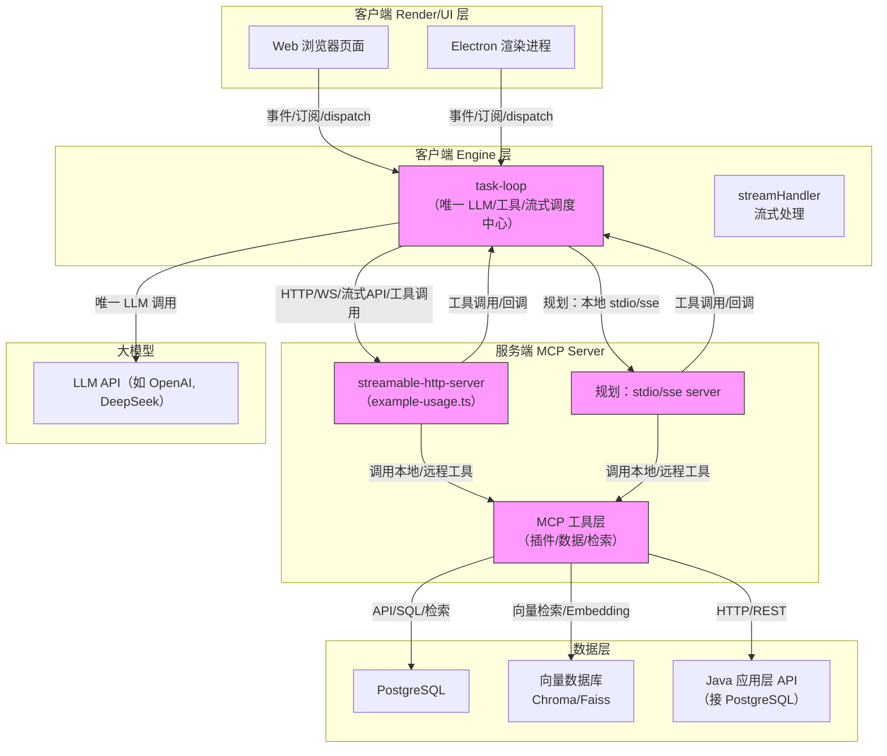

# LLM Engine 架构说明

本项目采用分层架构，核心思想是由客户端 Engine 层（task-loop）统一管理所有与大模型（LLM）和工具链的通信与调度，UI 层和服务端均不直接与 LLM 通信，极大提升了系统的可扩展性和解耦性。

---

## 架构总览



---

## 关键分层说明

### 1. Render/UI 层
- 负责所有用户交互和界面渲染（如 React 页面、Electron 渲染进程）。
- 只与 Engine 层通信，不直接与 LLM 或服务端通信。

### 2. Engine 层（核心：task-loop）
- 统一管理所有 LLM 通信、流式处理、工具链调用。
- 以 `task-loop` 为核心，负责消息生命周期、流式事件、工具链自动调度。
- UI 通过事件订阅/dispatch 与 Engine 层解耦。

### 3. MCP Server 层
- 负责工具链、插件、数据检索等服务。
- 支持 HTTP（streamable-http-server，见 example-usage.ts）和本地 stdio/sse 部署。
- 工具层可访问多种数据源和外部 API。

#### 多语言/多实例 MCP Server 与后端池化架构
在实际生产环境中，MCP Server 层通常需要支持高并发、异构后端和多语言实现。推荐架构如下：

- **线程池/Server池**：streamable-http mcp server 需实现线程池和 server 池，支持高并发请求调度。
- **多语言支持**：可用 Node.js、Python、Java（如 Spring AI）、云原生（如 Higress MCP Server）等多种实现。
- **多实例部署**：支持多 MCP Server 实例横向扩展，统一接入后端数据库和 API。
- **后端多样性**：MCP Server 可对接 PostgreSQL、向量数据库、Java 应用 API 等。

```mermaid
graph TD
  subgraph MCPServerPool[streamable-http MCP Server 池]
    S1[Node.js MCP Server]
    S2[Python MCP Server]
    S3[Java MCP Server\n(Spring AI)]
    S4[Higress 云原生 MCP Server]
  end

  subgraph Backend[后端服务/数据库]
    D1[PostgreSQL]
    D2[向量数据库\nChroma/Faiss]
    D3[Java 应用 API]
  end

  S1 -- SQL/REST/Embedding --> D1
  S1 -- 向量检索 --> D2
  S1 -- HTTP --> D3
  S2 -- SQL/REST/Embedding --> D1
  S2 -- 向量检索 --> D2
  S2 -- HTTP --> D3
  S3 -- SQL/REST/Embedding --> D1
  S3 -- 向量检索 --> D2
  S3 -- HTTP --> D3
  S4 -- SQL/REST/Embedding --> D1
  S4 -- 向量检索 --> D2
  S4 -- HTTP --> D3

  %% 池化说明
  classDef pool fill:#e0f7fa,stroke:#333,stroke-width:1px;
  class S1,S2,S3,S4 pool;
```

**架构要点：**
- MCP Server 池可动态扩容，支持多语言实现。
- 每个 MCP Server 实例可独立对接多种后端。
- 支持云原生部署（如 Higress MCP Server，详见 [higress官方文档](https://github.com/alibaba/higress/tree/main/plugins/wasm-go/mcp-servers)）。
- 线程池/Server池机制提升并发能力和稳定性。

### 4. 数据层
- 支持 PostgreSQL、向量数据库（Chroma/Faiss）、Java 应用层 API（可对接 PG）。
- MCP 工具层可通过 SQL、向量检索、REST API 等多种方式访问数据。

### 5. LLM 层
- 所有 LLM 通信均由 Engine 层 task-loop 统一调度。
- 支持 OpenAI、DeepSeek 等主流大模型。

---

## 设计要点
- **解耦**：UI、服务端、数据层均不直接与 LLM 通信，所有流转由 Engine 层统一管理。
- **可扩展**：MCP 工具层可灵活扩展多种数据源和外部服务。
- **流式体验**：task-loop 支持流式响应、工具链自动调用，极大提升交互体验。
- **多端支持**：支持浏览器、Electron 等多端部署，通信协议灵活。

---

如需进一步细化某一层的实现细节或扩展方案，请参考各层源码或联系维护者。 