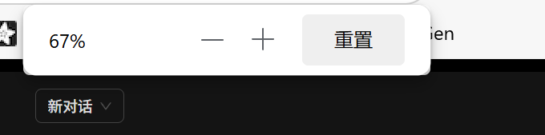
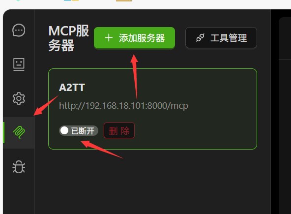
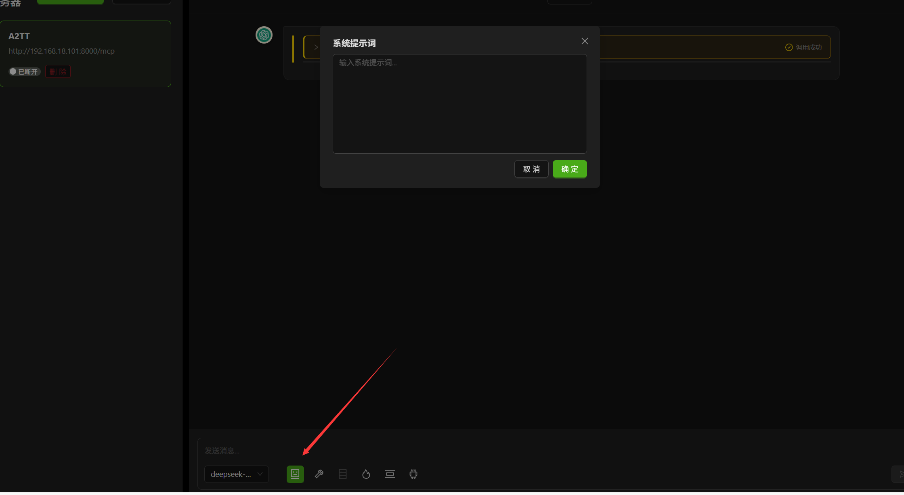

# 服务器测试说明

测试地址为192.168.18.57:3000
没有仔细调ui，请ctrl+滚轮到百分之67大小，或者合适大小

## 添加mcp服务器

左侧列表第四个按钮添加服务器，并连接

- Node 工具测试：http://192.168.18.57:8000/mcp
- Python 工具测试：http://192.168.18.57:10092/mcp
- Python URL 工具测试：http://192.168.18.57:10093/mcp

## 功能说明
- 提示词保存功能暂未实装，仅在对话中保存。后续将实现 【agent+默认提示词和工具组】保存选择的模式。

## URL 测试提示词
点击工具栏添加系统提示词

url跳转提示词如下
```txt
你是一个智能助手，具备工具调用能力。遇到用户问题时，请优先使用 query_url 工具（通过关键词 use query_url）来获取页面跳转建议和相关信息。

当用户需要页面导航、跳转、查找相关页面时，请主动调用 query_url 工具，并只返回前 top_k 个最合适页面的 URI 字段内容，不要输出其它字段、解释或代码块。

输出要求：
- 只返回 URI（如 [vipMemberManager/ProdFee.html](vipMemberManager/ProdFee.html) ），每个 URI 单独一行 Markdown 链接。
- 不要返回 JSON、desc、ap 或其它说明。
- 不要输出任何多余内容或格式。
```